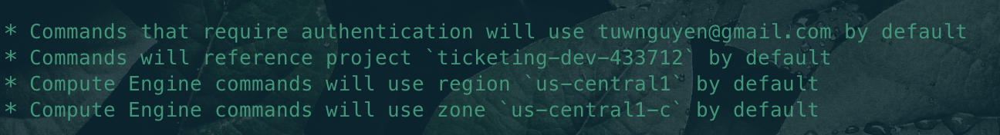
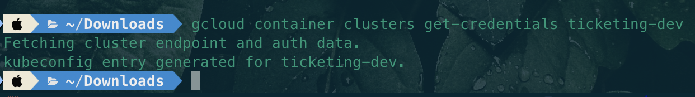
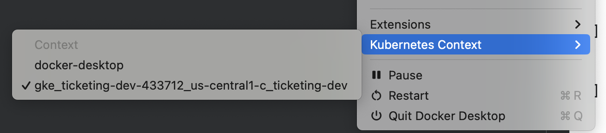
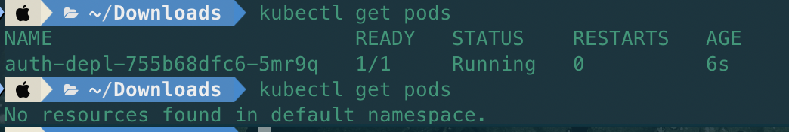
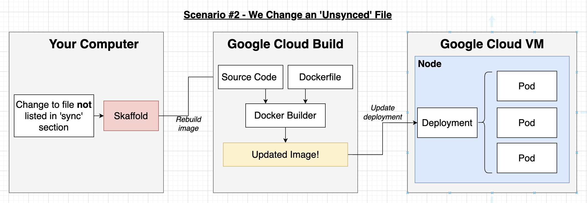
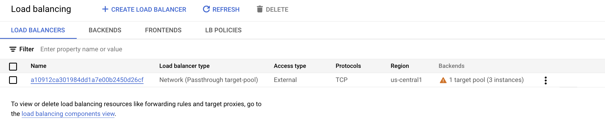

# AWS Guide

## Installation GCloud CLI/SDK

[Install](https://cloud.google.com/sdk/docs/install)

```bash
gcloud auth login
gcloud init

Default Region and Zone? (y/n)? y

```


## Installation the GCloud Context

```bash
gcloud container clusters get-credentials <cluster-name>
gcloud components install gke-gcloud-auth-plugin


```


 - Check context of Docker Desktop and using context to communicate with clusters(local or remote)
 

 - Check pods in cluster
 

## Unable GG Cloud Build API

### Setup Cloud Build when skaffold
 - Instead of using image in docker hub
 
 ```bash
 skaffold dev
 ```
 - Push image to `us.gcr.io/ticketing-dev-433712/auth` repository

## Loading Balancing
When create a new cluster, it also creates a new load balancer



