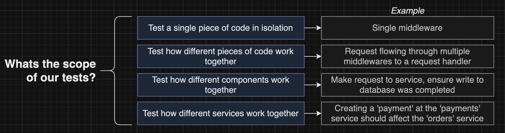

# Section 10: Testing Isolated Microservices

## Scope of Testing
## Testing Goals
## Testing Architecture
[LInk doc](https://app.diagrams.net/#G1D05CBdlTbSdUBQqo_d3XpXmDUU1mm52l#%7B%22pageId%22%3A%22CBauR4w0Lt-ZCHWAu02Y%22%7D)



## Index ts to App ts Refactor
## Test Environment Setup
 - Install dependencies for testing
 ```bash
    npm i --save-dev @types/jest @types/supertest jest ts-jest supertest mongodb-memory-server
 ```
 - Supertest fake requests
 [Link doc](https://github.com/ladjs/supertest#readme)
 
 - Jest does't know TS so using ts-test to support
 ```json
  "jest": {
    "preset": "ts-jest",
    "testEnvironment": "node",
    "setupFilesAfterEnv": [
      "./src/test/setup.ts"
    ]
  },
 ```
 - MongoMemoryServer
 [Link doc](https://typegoose.github.io/mongodb-memory-server/docs/guides/integration-examples/test-runners/)

