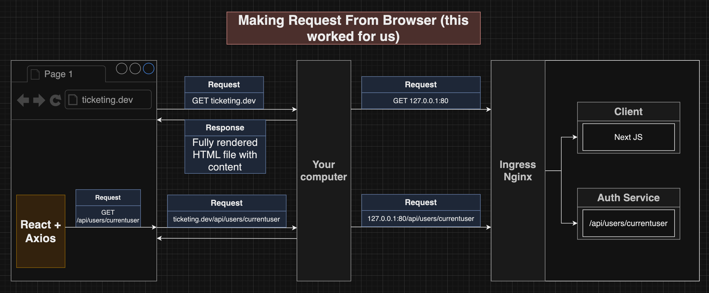
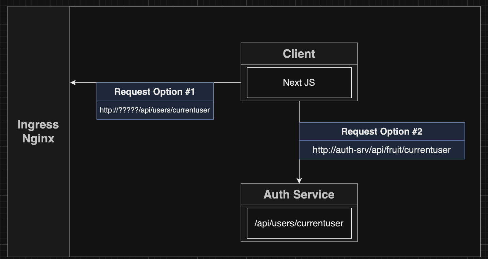

# Section 11: Integrating a Server-Side-Rendered React App

## Reminder on Server-Side-Rendering
 - Pros and Cons

## Nextjs
 - Behind the scenes when Next render initial
 

## Error Confused URL when call axios inside server-side
 - [Link doc](https://app.diagrams.net/#G1HaewXCw605JcuUvepBM96KyaO5tD7Kby#%7B%22pageId%22%3A%22eBulHmyMRUKZekjZkh-w%22%7D)
 ```javascript
    const Landing = ({ currentUser }) => {
      console.log(currentUser);
      axios.get("/api/users/currentuser");
      return <h1>Landing page</h1>;
    };

    // Landing.getInitialProps = async () => {
    //   const response = await axios.get("/api/users/currentuser");
    //   return response.data;
    // };
 ```



 - Solutions:
 
 

 - Namespaces in K8S
 ```bash
 kubectl get namespace
 ```

 
 

## When is GetInitialProps is called


## Specify the Host in server
<pre>http://SERVICENAME.NAMESPACE.svc.cluster.local</pre>

## Issues with Custom App GetInitialProps


