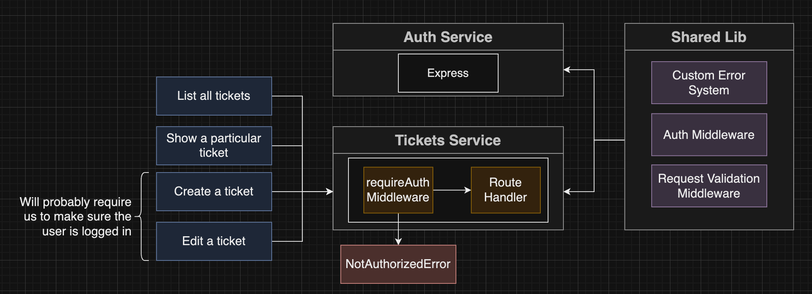
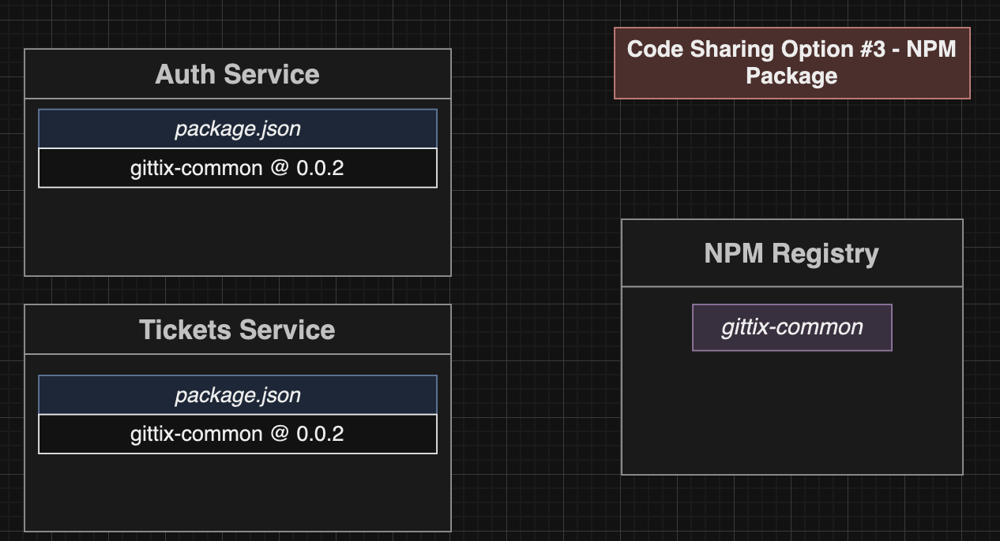
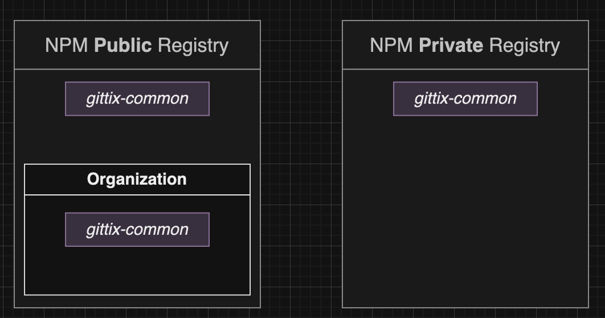
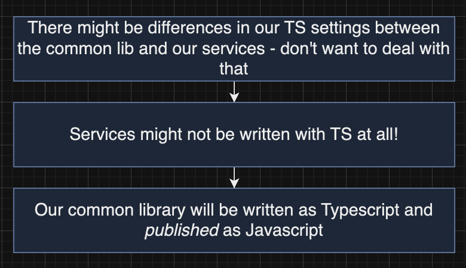

# Section 12: Code Sharing and Reuse Between Services

## Shared Logic between Services
 - Code sharing
 
 

## NPM Organizations
 - Npm Registry
 
 - The way implementation
 

## Create module
 - Setup repository
 - Init git repository and commit code
 - Create repository with `tsc --init`
 - Config in `tsconfig.json`
  ```bash
  
  npm install typescript del-cli --save-dev`
  npm login`
  npm publish --access public
  ```

## Publishing NPM Modules
  ```bash
  npm version patch && npm run build && npm publish
  ```
## NPM Update Command
  ```bash
  npm install @YOUR_ORG_NAME/common@latest
  ```
