# Section 7: NATS Streaming Server - An Event Bus Implementation

## 3 Important Items
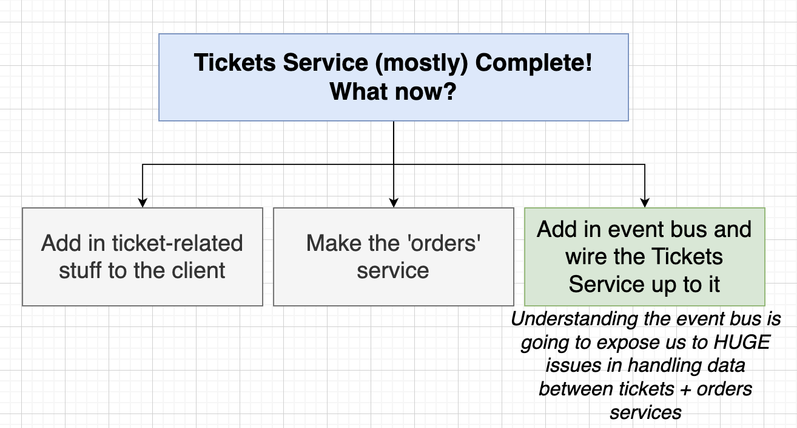

## Creating a NATS  Streaming Deployment
  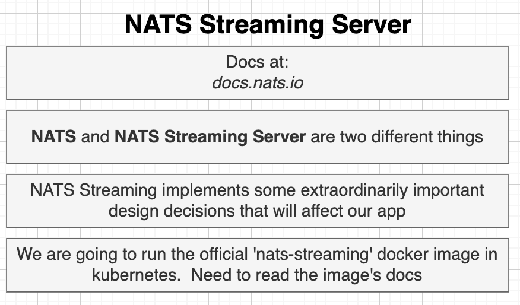
  - [nats](https://docs.nats.io/nats-concepts/what-is-nats)
  - [stan](https://nats-io.gitbook.io/legacy-nats-docs/nats-streaming-server-aka-stan)
  - [docker image](https://hub.docker.com/_/nats-streaming/tags?page=2&page_size=&name=&ordering=)

## Big NOTES on NATS Streaming
  - [Link doc](https://app.diagrams.net/#G147m2DpcGc6ZohR3sCCikp1dy8gBtp0kl#%7B%22pageId%22%3A%22MT4oPxpP2oYoOqEBfzcg%22%7D)
  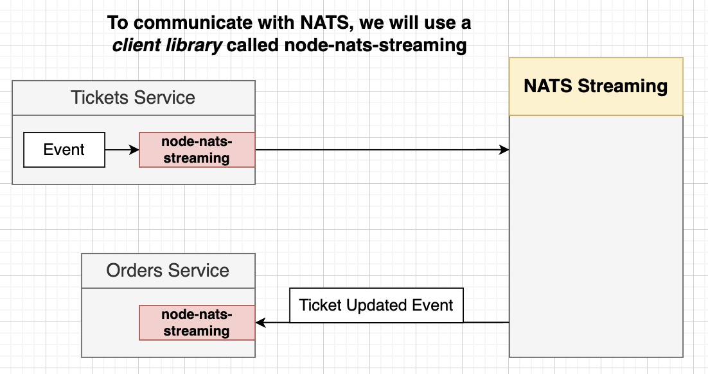

## Building a NATS Test Project
  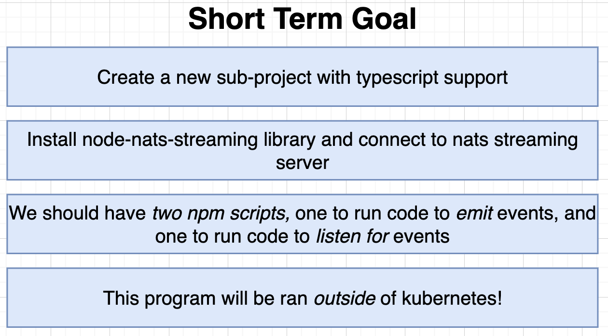
  
  - Create a Publisher Program
  - In package.json, add script
  ```json
  "scripts": {
    "publish": "ts-node-dev --notify false src/publisher.ts",
    "listen": "ts-node-dev --notify false src/listener.ts"
  },
  ```
  
  ```javascript
  npm i node-nats-streaming ts-node-dev typescript @types/node
  ```
  [Link doc node-nats-streaming](https://www.npmjs.com/package/node-nats-streaming)
## Port-Forwarding with Kubectl
  - Options to connect to NATS Pod
  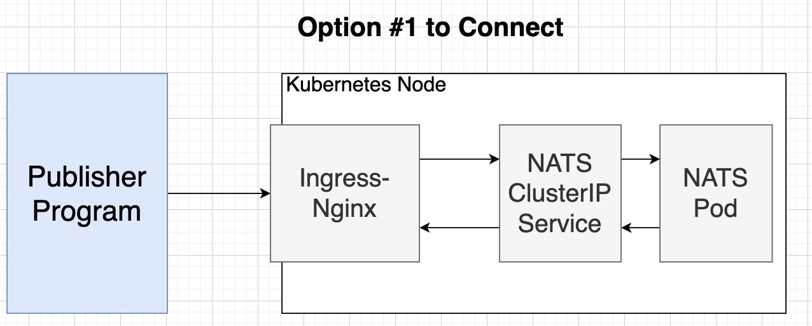
  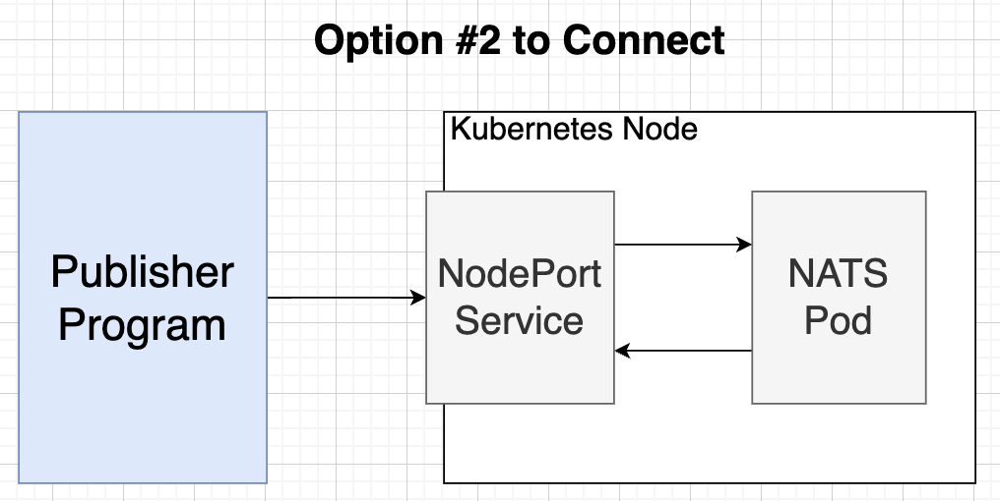
  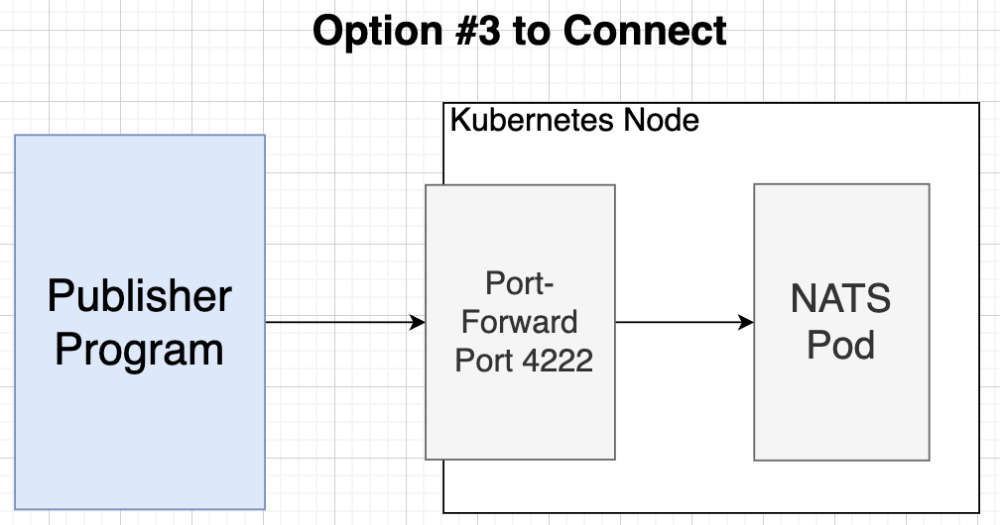
  
  - Choose opt 3
  ```bash
  kubectl port-forward nats-depl-687f65f5b8-kh6xx 4222:4222
  ```
  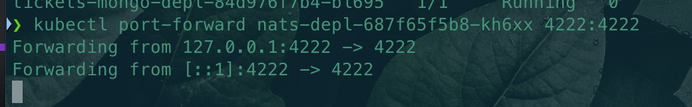


## Publish Events
  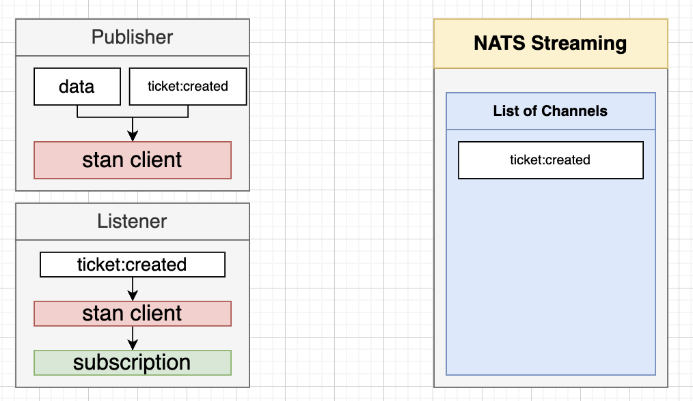
  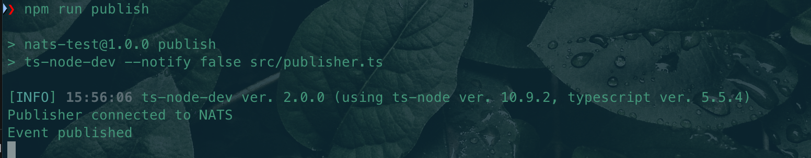

## Listen Events
  - Config again script `--rs` in package.json so we can restart the publisher and listener...
  ```json
  "scripts": {
    "publish": "ts-node-dev --rs --notify false src/publisher.ts",
    "listen": "ts-node-dev --rs --notify false src/listener.ts"
  },
  ```
  - Type `rs` to restart the instance
  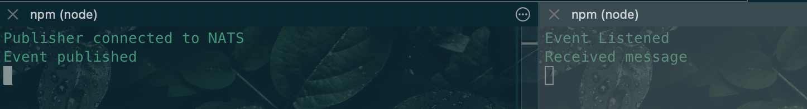

## Accessing Event Data
## Client ID Generation
  - NATS Streaming Server never wants to see duplicated client ID
  - We must create unique client ID for every service

## Queue Group
  - If a service when scaled up will have 2 or more instances, we must create a common Queue Group so that when there is an Event, only 1 instance can receive that Event. Avoid duplicate data.
  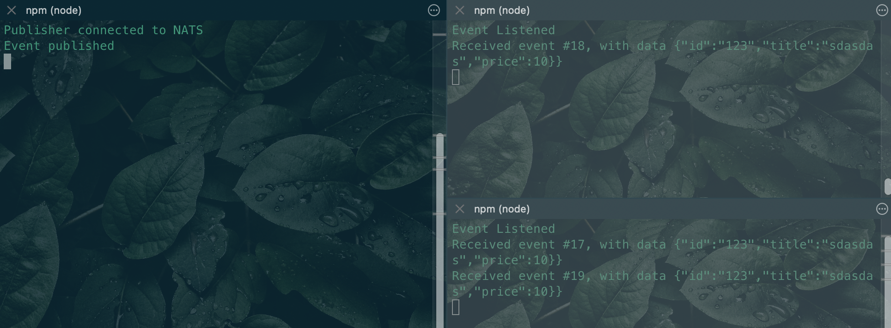
  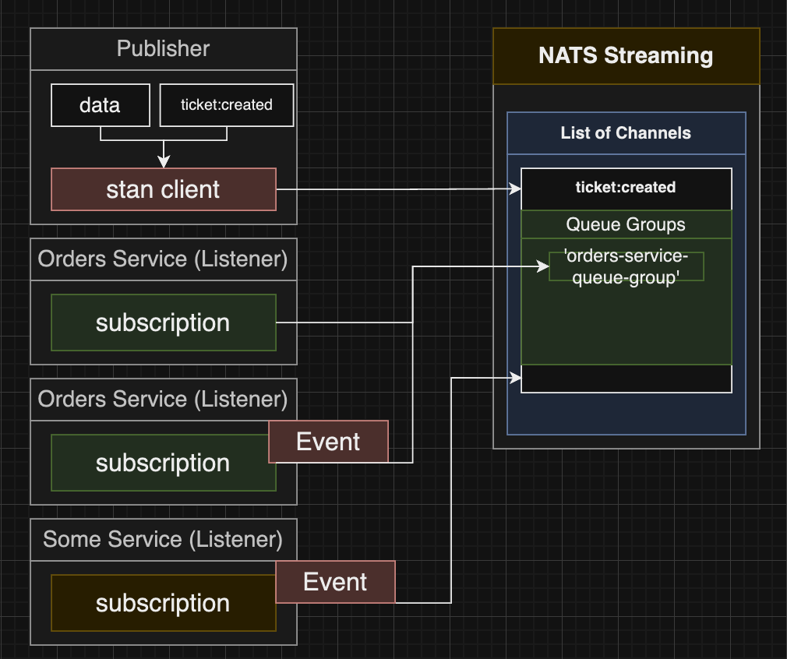

## Manual Ack Mode
  - Situation:
  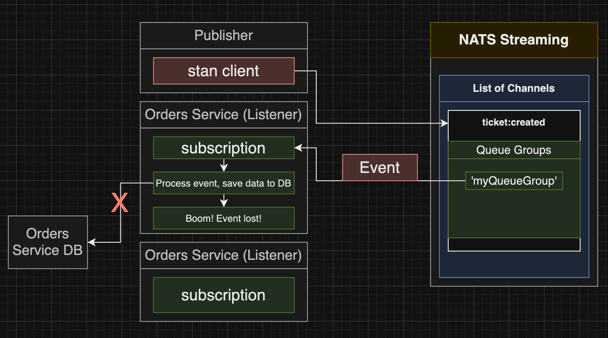
  - Ack Mode: aka Acknowledgement mode
  - The Default behavior of the Event said NATS that we received the event, everything is Ok.
  - The default timeout of NATS for waiting Event successful or not is `30 sec`
  - But if we set ack mode in subscription, after 30s, NATS will send event to another instance a identical event, and continue to do it to another instance.
  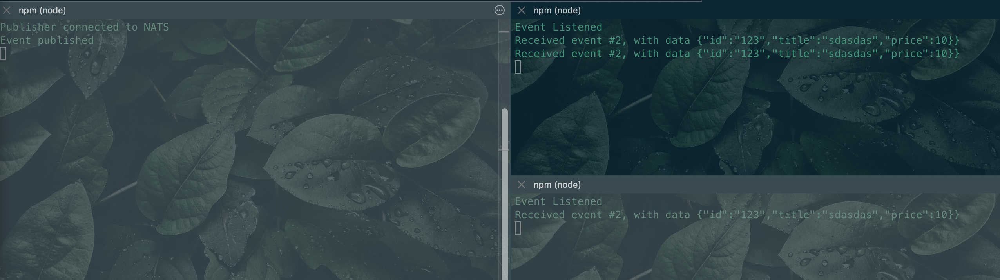

  - Must set `ack()` in `message`
  - Mean time, NATS says OK, it's been delivered, NATS doesn't have to worry about that Event # anymore

## Clien Health Checks
  - We can access to the monitoring of NATS
  - `localhost:8222/streaming`
  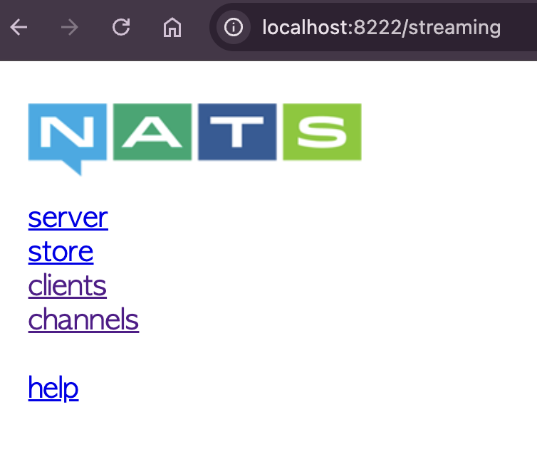

  - Debugging subscription in the channel
  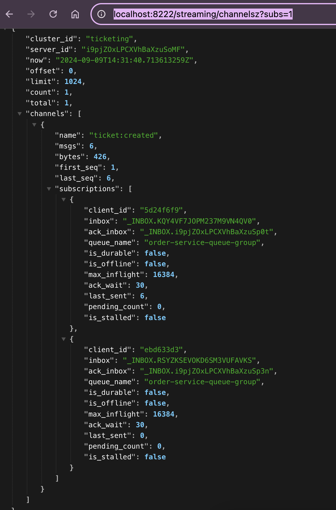

  - Sometime, when listener are offline, NATS monitoring still think it is still online and send the message(so message will be missing when listener is online again)
  - And we eventually realized that there was a period of time after we killed a listener during this restart process inside of our terminal. We're that streaming server thought that that client still might be active.
  - So we spoke about one way to help Nats figure out that the client wasn't active.
  - We could adjust those heartbeat values.

## Graceful Client Shutdown
  - We must config to NATS that a closed client really is closed and that it should not try to send it any more messages.
  ```javascript
  stan.on("close", () => {
    console.log("NATS connection closed!");
    process.exit();
  });

  // INTERRUPT SIGNAL
  process.on("SIGINT", () => stan.close());

  // TERMINATE SIGNAL
  process.on("SIGTERM", () => stan.close());
  ```

## Core Concurrency Issues
[Link doc](https://www.udemy.com/course/microservices-with-node-js-and-react/learn/lecture/19124562#overview)
[Link doc](https://app.diagrams.net/#G147m2DpcGc6ZohR3sCCikp1dy8gBtp0kl#%7B%22pageId%22%3A%222CAoaLWg3fweDvEjDoyI%22%7D)
https://app.diagrams.net/#G147m2DpcGc6ZohR3sCCikp1dy8gBtp0kl#%7B%22pageId%22%3A%22GfNgocw59WVVDyixqvAD%22%7D

[issue1](https://app.diagrams.net/#G147m2DpcGc6ZohR3sCCikp1dy8gBtp0kl#%7B%22pageId%22%3A%22GfNgocw59WVVDyixqvAD%22%7D)
[issue2](https://app.diagrams.net/#G147m2DpcGc6ZohR3sCCikp1dy8gBtp0kl#%7B%22pageId%22%3A%22WoKbjGjm4YJylSEZJy-B%22%7D)
[issue3](https://app.diagrams.net/#G147m2DpcGc6ZohR3sCCikp1dy8gBtp0kl#%7B%22pageId%22%3A%221yQV2JXKVe3gF2WSqFVf%22%7D)

## Common Questions
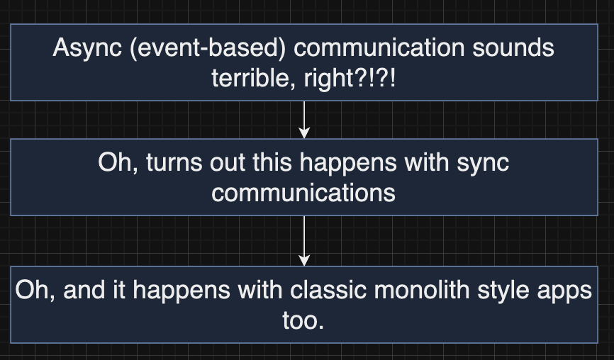
[Link doc](https://www.udemy.com/course/microservices-with-node-js-and-react/learn/lecture/19124570#questions)

## Summary Concurrency Issues
 - #Issue 1: **NATS might think a client is still alive when it is dead**
 - #Issue 2: **One listener might run more quickly than other**
 - #Issue 3: **We might receive the same event twice**
 - #Issue 4: **Listener can fail to process the event**

## More Possible Concurrency Solutions
 - Event Bus/Streaming Server is one way connection, not send back from NATS to Publisher
[link doc](https://www.udemy.com/course/microservices-with-node-js-and-react/learn/lecture/19124576#overview)
[link diagram](https://app.diagrams.net/#G1xzTZchPa1FW5bzjmdytHrCrU0kWSfQJk#%7B%22pageId%22%3A%22hYokQvlYxo5EsQW8T5a8%22%7D)

## Solving Concurrency Issues
[link doc](https://www.udemy.com/course/microservices-with-node-js-and-react/learn/lecture/19124578#overview)

  - Using **Transaction/Versioning Service**
[link diagram](https://app.diagrams.net/#G1xzTZchPa1FW5bzjmdytHrCrU0kWSfQJk#%7B%22pageId%22%3A%22kjYP9-PfglUKapugs25E%22%7D)
[link diagram](https://app.diagrams.net/#G1xzTZchPa1FW5bzjmdytHrCrU0kWSfQJk#%7B%22pageId%22%3A%22VjTmH5QIHiUtfdSmPJ5_%22%7D)

## Concurrency Control with the Tickets app

## Event Redelivery
  - `setDeliverAllAvailable()`: get all events from the past
  - `setDurableName()`: distinguish which events already proccessed, and keep track of all the different events that have gone to this subscription or the queue group, even if it goes offline for a little bit.
  - `queue group`: to make sure that we do not accidentally dump the durable name, even if all of our services restart for a very brief period of time, and to make sure that all these emitted events only go off to one instance of our services, even if we are running multiple instance
  - These three options really all mesh together extremely well [`setDeliverAllAvailable(), setDurableName(<name>), queue group`]

  [Link explaination video](https://www.udemy.com/course/microservices-with-node-js-and-react/learn/lecture/19124592#notes)

