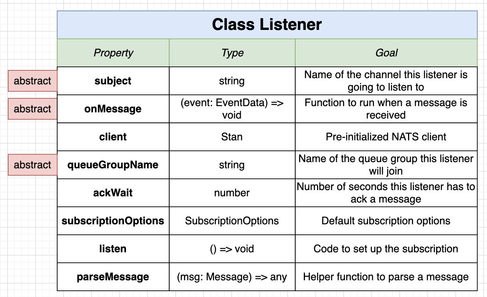
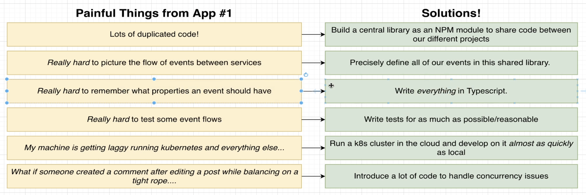
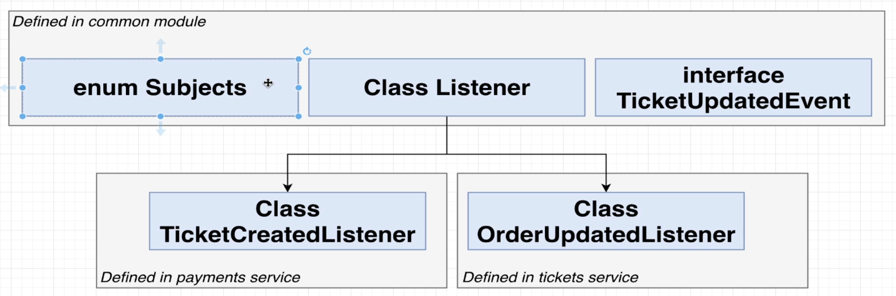
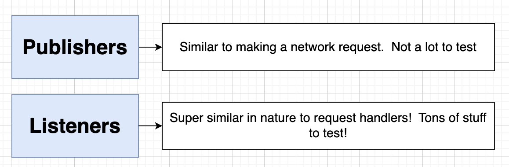
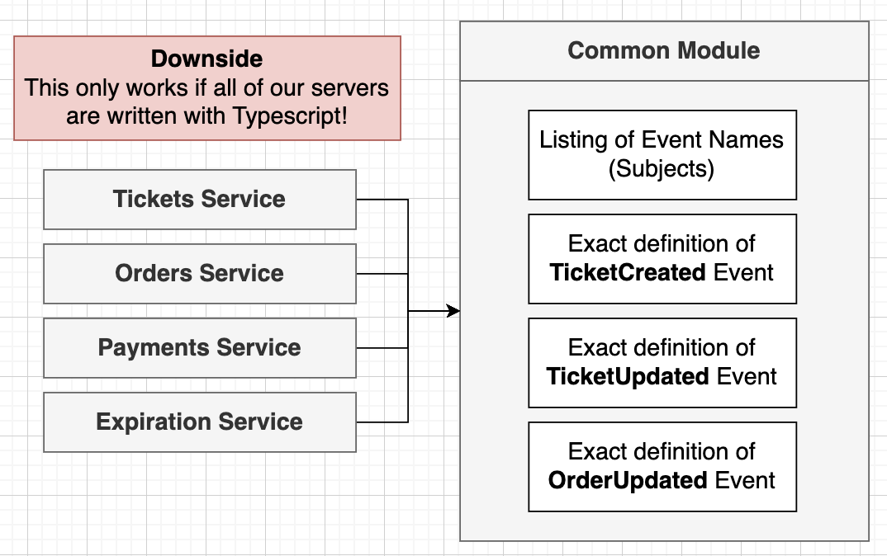
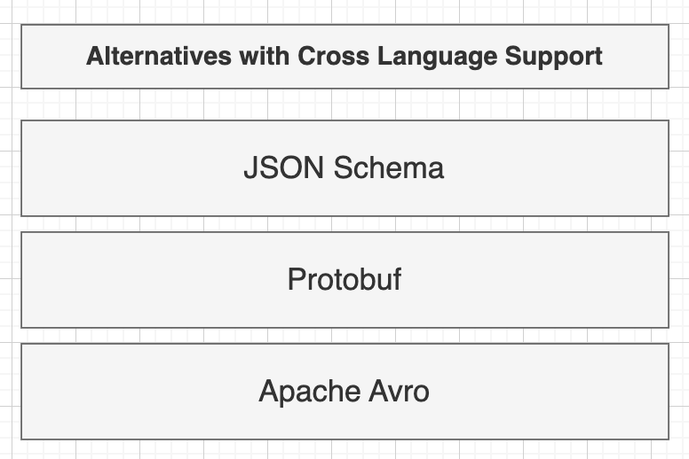

# Section 7: Connecting to NATS in a Nodejs World

## Reusable NATS listener
## The Listener Abstract Class

## Leverage TypeScript for Listener Validation

## Subjects Num
## Custom Event Interface
## Enforcing Listener Subjects
## Enforcing Data
## Custom Publisher

## Awaiting Event Publication
## Common Event Definition Summary

  - But because all services using TypeScript, if each service use a different language implementation, they can not use common module
  

  - Alternatives with Cross Language Support
  