# Section 16: Managing a NATS Client

## Publishing Ticket Creation

## NATS Client Singleton
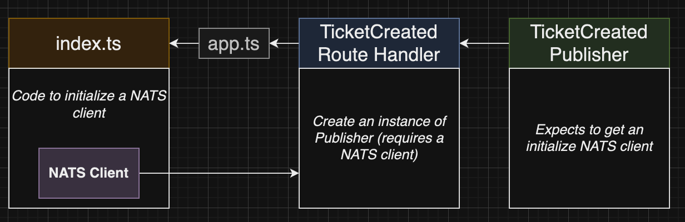
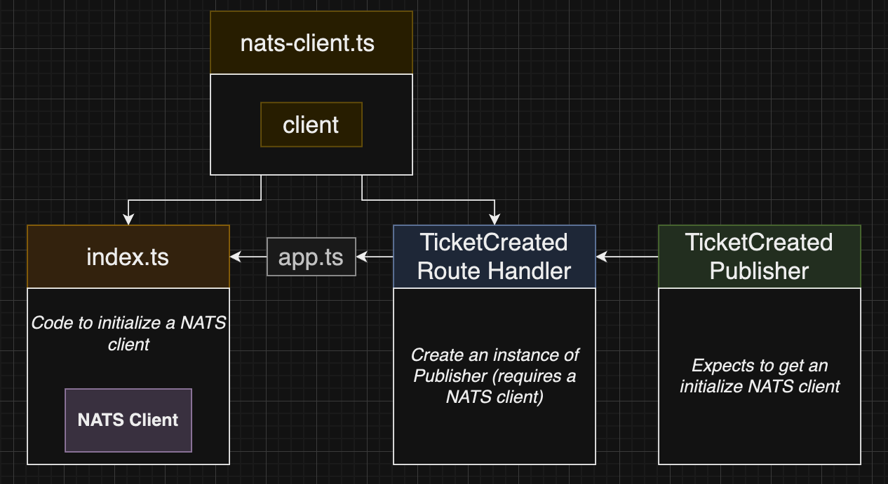
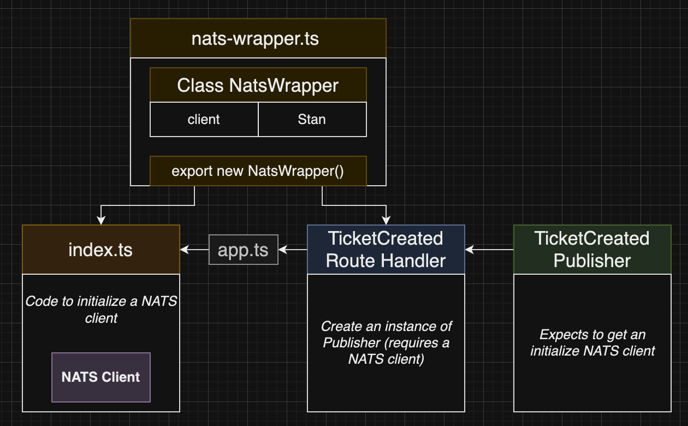
  - Để tránh được việc phụ thuộc lẫn nhau giữa index.ts and Ticket Route Handler
  - The goal of this file is going to be to somehow create a Nats client and behave as a *singleton* of sorts
  - So we're going to try to build something very similar to Mongoose, where we're going to have some kind of object that internally **keeps track of some client** and makes it available to everything else inside of our app

  **Mongoose**
  - Tương tự như với Mongoose, khởi tạo mongoose client trong file index.ts nhưng trong Model lại dùng instance khác, đây là lý do phải dùng singleton để khai báo mongoose
  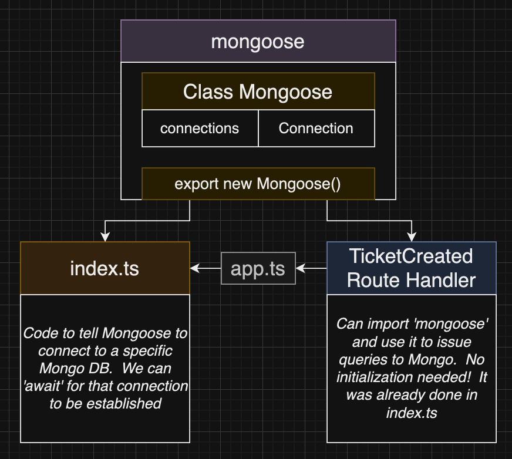

## Single Implementation
  - Note: Chuyển callback function sang promise để sử dụng async await
  ```typescript
  this._client.on('connect', () => {
    console.log('Connected to NATS')
  })
  ==>
  return new Promise<void>((resolve, reject) => {
    this._client.on('connect', () => {
      console.log('Connected to NATS')
      resolve()
    })
  })
  ```

## Accessing the NATS Client

## Gracefull Shutdown
  - Khi delete NATS deployment thì Tickets depl cũng restart lại server khi NATS connection bị mất.
  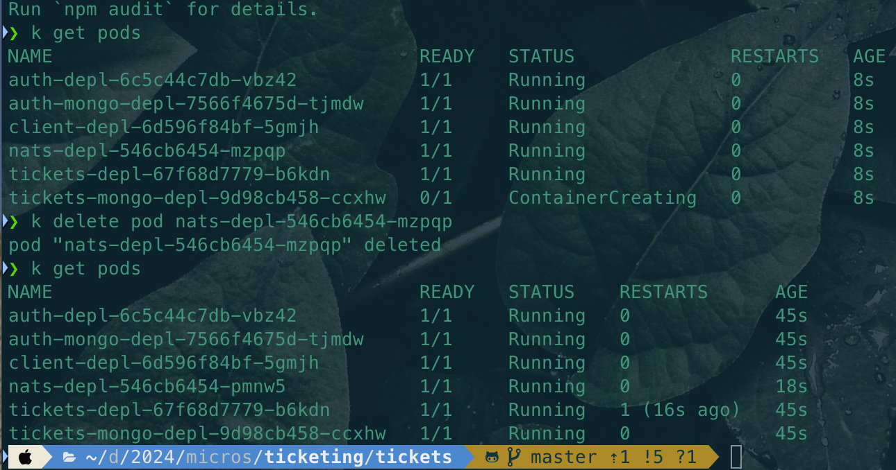


## Failed Event Publishing
  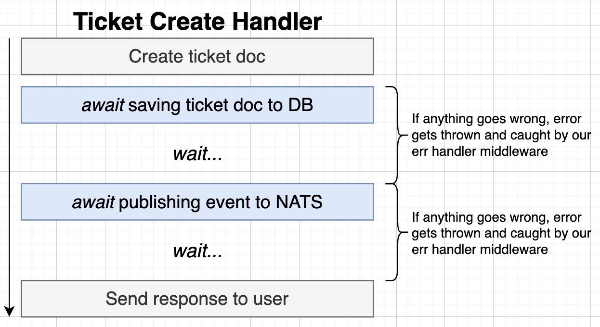
  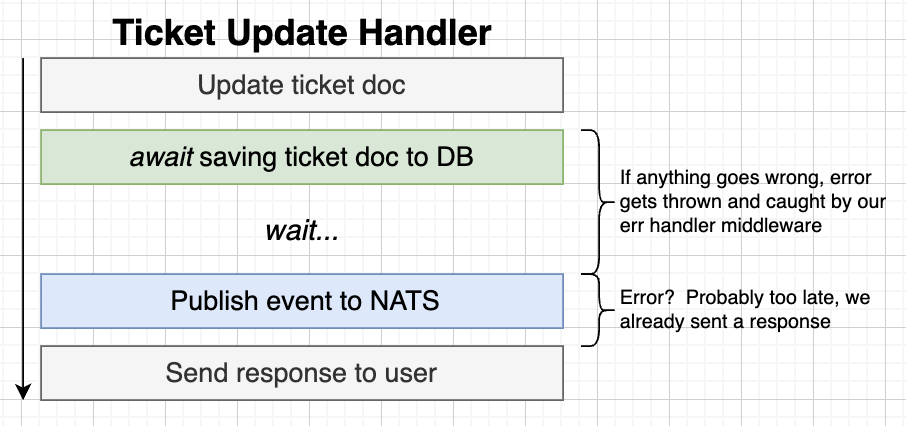
  
  - Examle in Banking Service
  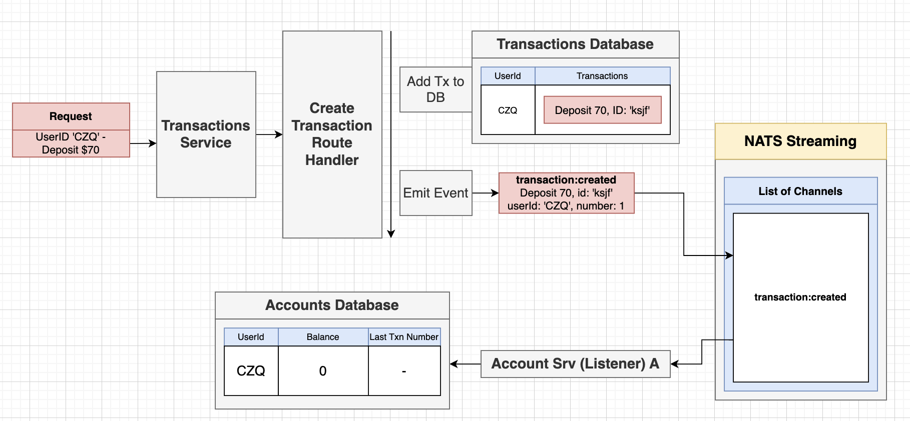

  - Connection Lost in NATS: Transaction DB already update the Transaction but Account DB still doesn't update
  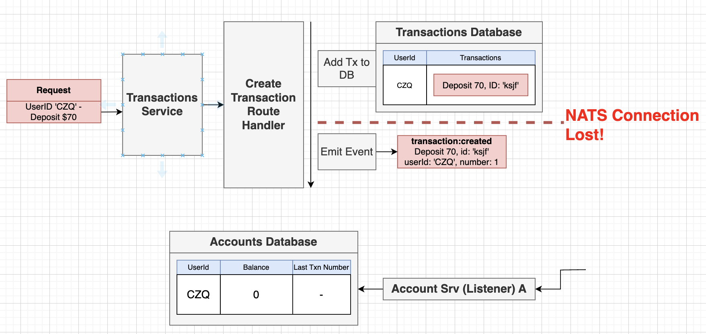

## Handling Publish Failures
  - Solution
  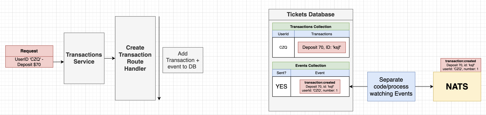
  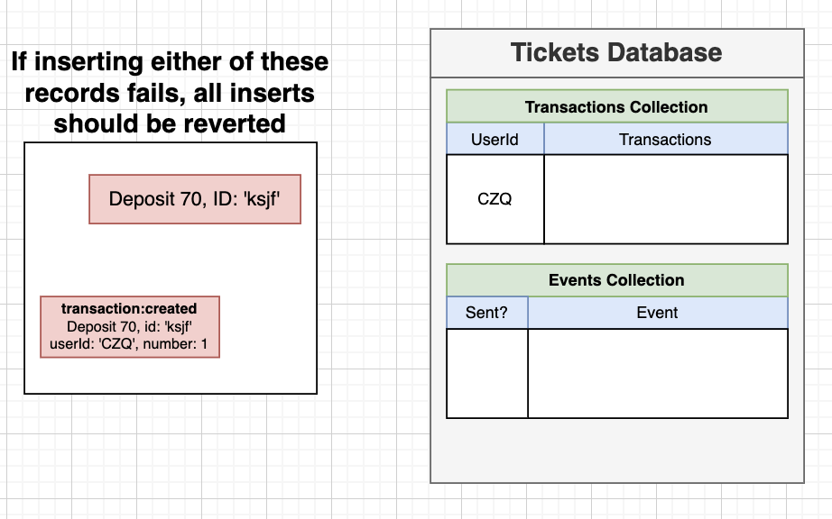

## Fixing a Few Tests
  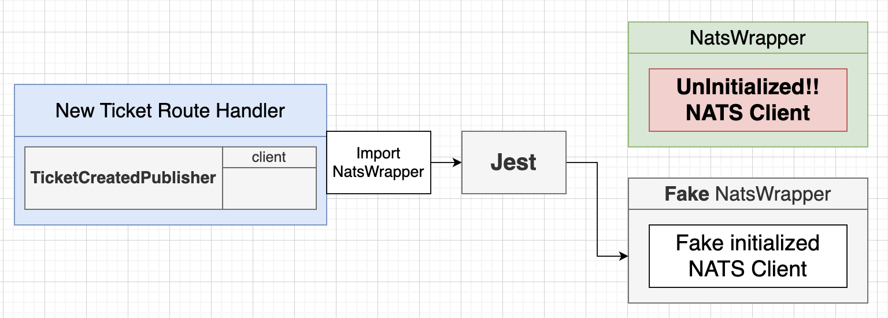
  - Press **P** in terminal, if we want to test specific test case
  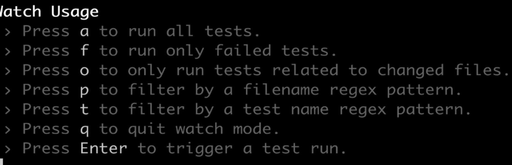

## Redirecting Imports
## Providing a Mock Implementation
## Test-Suite Wide Mocks
## Ensuring Mock Invocations
[link diagram](https://app.diagrams.net/#G1lgyeLffO_J43VNdMB9kNL2ZnU90ddlNC#%7B%22pageId%22%3A%226VYg3lWQIe4TUKlxoWgk%22%7D)

## NATS Env Variables
  - Add NATS env variables to Deployment

