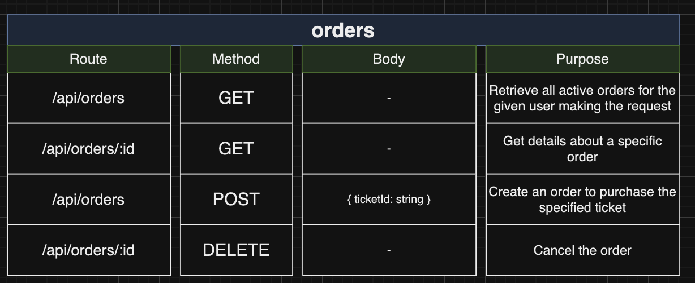
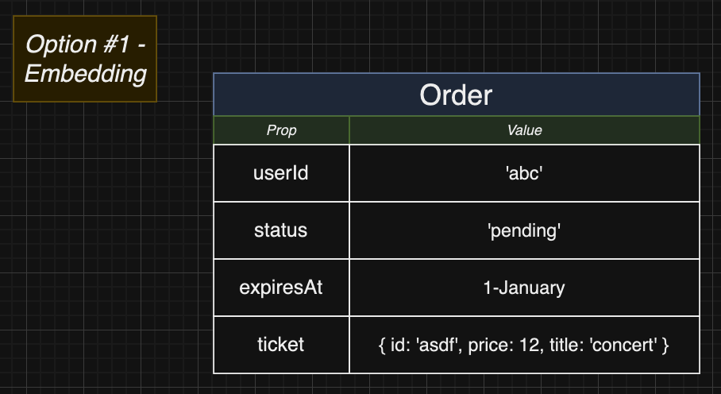
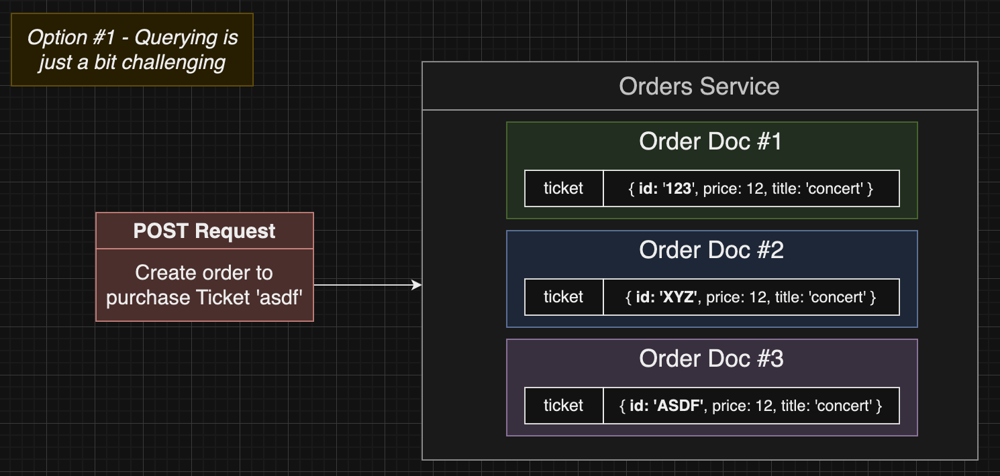
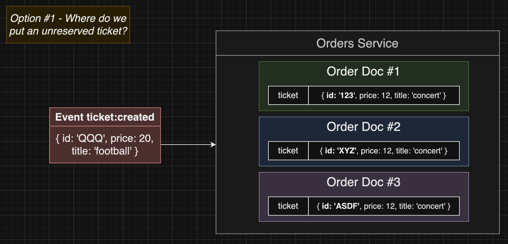
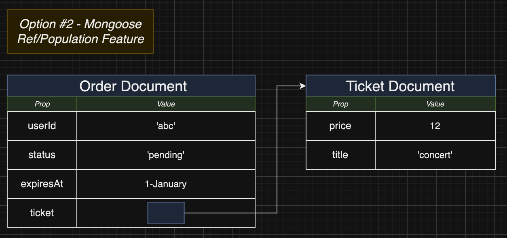

# Section 17: Cross-Service Data Replication In Action

## The Order Service

[link diagram](https://app.diagrams.net/#G10LKwdSjZP-XurtS4Lr14BjuBhDFqwcjA#%7B%22pageId%22%3A%22ltWhhco4U17ivq6xlQ46%22%7D)

## Subtle Service Coupling
  - Khi tạo order thì ticketId phải match với MongoDB Id
  ```typescript
  body("ticketId").custom((input: string) => mongoose.Types.ObjectId.isValid(input))
  ```

## Associating Orders and Tickets
  - Các option để associate giữa Order Doc and Ticket Doc
  - Embedding
  
  
  
  - 
  

## Order Model Setup
## The Need for an Enum
## Creating an Order Status Enum
## More on Mongoose Refs
## Defining the Ticket Model

## Order Creation Logic
## Finding Reserved Tickets
## Convenience Document Methods
## Order Expiration Times
## Asserting Tickets Exist

## Asserting Reserved Tickets

## Testing the Success Case

## Fetching a User's Orders

## A Slightly Complicated Test

## Fetching Individual Orders

## Does Fetching Work?

## Cancelling an Order

## Can We Cancel?


