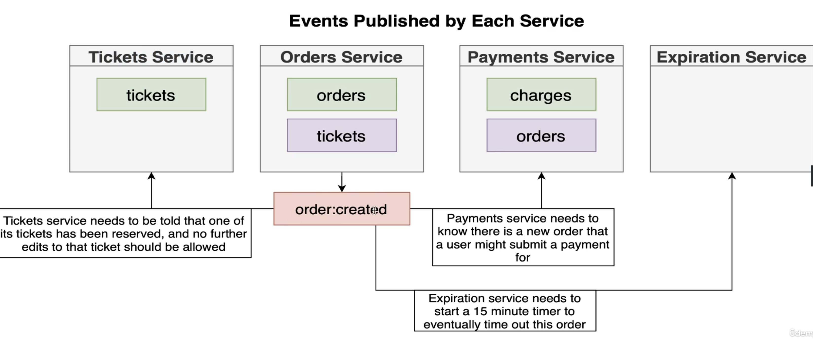
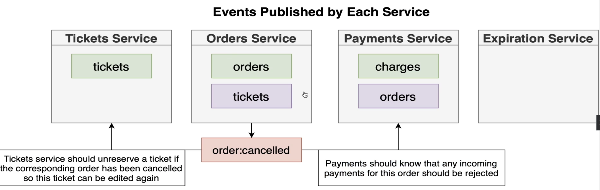

# Section 18: Understanding Event Flow

## Orders Service Events

## Creating the Events
## Implementing the Publishers
## Publishing the Order Creation
## Publishing Order Cancellation
## Testing Event Publishing