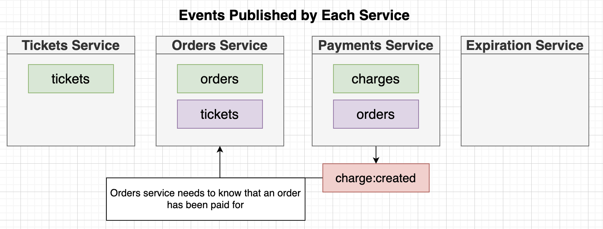

# Section 19: Listening for Events and Handling Concurrency Issues

## Time for Listeners





## Reminder on Listeners
## Blueprint for Listeners
## A Few More Reminders
## Simple onMessage Implementation

## ID Adjustment
  - Khi tạo ticket giữa 2 services ticket and orders thì ticketId phải giống nhau/consistent
  

## Ticket Updated Listener Implementation


## Initializing the Listeners


## A Quick Manual Test


## Clear Concurrency Issues
[link video](https://www.udemy.com/course/microservices-with-node-js-and-react/learn/lecture/19565112)

[link diagram](https://app.diagrams.net/#G1vk_kvCJxeGED_mrl_Hp9uAMWN6TFQQKv#%7B%22pageId%22%3A%22s2ZtXvtPkM39lvie7NOL%22%7D)

## Reminder on Versioning Records
[link video](https://www.udemy.com/course/microservices-with-node-js-and-react/learn/lecture/19565116)

## Optimistic Concurrency Control
[link video](https://www.udemy.com/course/microservices-with-node-js-and-react/learn/lecture/19565120)


## Mongoose Update-If-Current
[link video](https://www.udemy.com/course/microservices-with-node-js-and-react/learn/lecture/19565124)
[mongoose update if current](https://www.npmjs.com/package/mongoose-update-if-current)
```bash
npm i mongoose-update-if-current
```

## Implementing OCC(Optimistic Concurrency Control) with Mongoose

```typescript
ticketSchema.set("versionKey", "version");
ticketSchema.plugin(updateIfCurrentPlugin);
```

## Who Updates Versions?
  - Rule chỉ mỗi service chính mới có quyền update version


## Including Versions in Events
## Updating Tickets Event Definitions
## Applying a Version Query
## Did it Work?
  ### Write Script to test Concurrency
  [link video](https://www.udemy.com/course/microservices-with-node-js-and-react/learn/lecture/19565154)

## Abstracted Query Method

## [Optional] Versioning Without Update-If-Current
  - Không thể lúc nào cũng tăng version lên 1 được
  
  

  - Try to replace update-if-current module
  

  ```typescript
  // customizes the find-and-update operation (save) to look for the correct version
  ticketSchema.pre("save", function (done) {
    this.$where = {
      version: this.get("version") - 1,
    };
    done();
  });

  // ... 
  // must update the version
  ticket.set({ title, price, version });
  await ticket.save();
  ```

## Testing Listeners
## A Complete Listener Test
## Testing the Ack Call
## Testing the Ticket Updated Listener
## Success Case Testing
## Out-Of-Order Events

## Listeners in the Tickets Service
## Building the Listener

## Strategies for Locking a Ticket
  - Solution 1:

  - Solution 2:


## Reserving a Ticket
## Setup for Testing Reservation
## Test Implementation

## Missing Update Event?
  - Wait?
  - 
  - 
  - 
  - 
  - Sau khi nhận xử lý logic của event OrderCreated, phải Publish event TicketUpdated

## Private vs Protected Properties
  
  
  
## Publishing While Listening
## Mock Function Arguments
## Order Cancelled Listener
## A Lightning-Quick Test
## Don't Forget to Listen!
## Rejecting Edits of Reserved Tickets
[link video](https://www.udemy.com/course/microservices-with-node-js-and-react/learn/lecture/19565264)