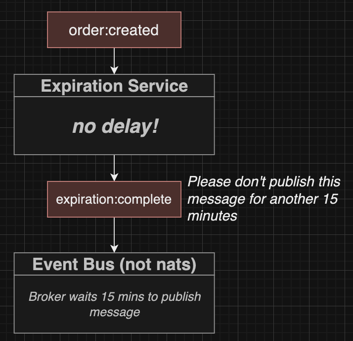

# Section 20: Worker Services

## The Expiration Service

## Expiration Options
  - Don't use setTimeout

  - Don't rely on NATS redelivery mechanism (NATs chỉ tối đa gửi 5 lần event)
  

  - Using Event Bus service, NATS does not support event bus
  

  - Using Bull.js and Redis
  

## Initial Setup

## A Touch of Kubernetes Setup
## File Sync Setup
## Listener Creation

## What's Bull All About?
  - Install job processing manager **bulljs**
  [Bull js](https://www.npmjs.com/package/bull)
  
  
  

## Creating a Queue
  - Queue up/Brand new job
  

## Queueing a Job on Event Arrivale

## Testing Job Processing

## Delaying Job Processing

## Defining the Expiration Complete Event

## Publishing an Event on Job Processing

## Handling an Expiration Event

## Emitting the Order Cancelled Event

## Testing the Expiration Complete Listener

## A Touch More Testing

## Listening for Expiration