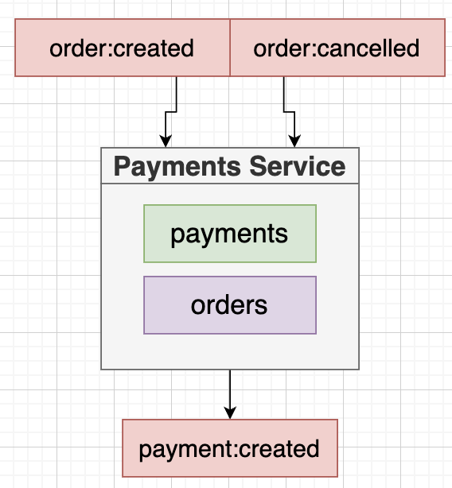
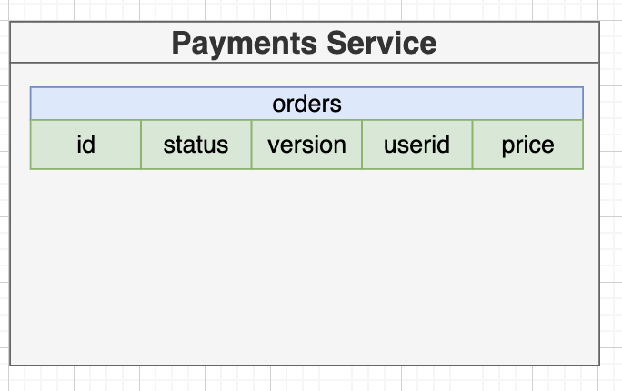
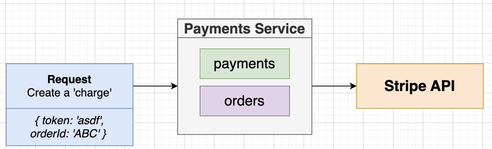
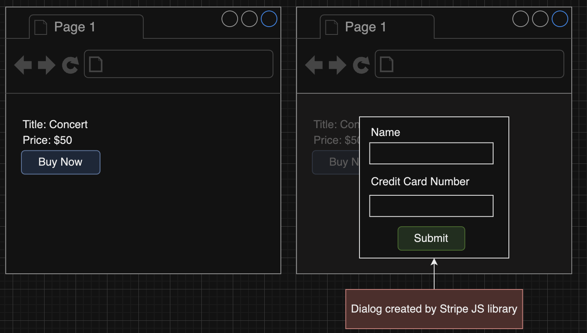
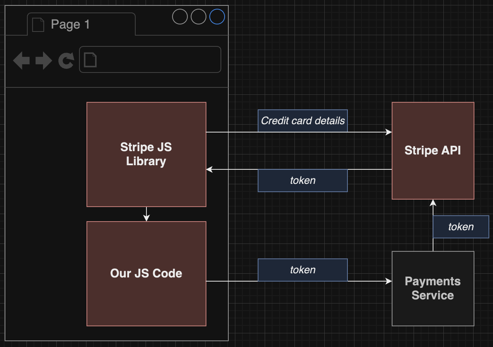
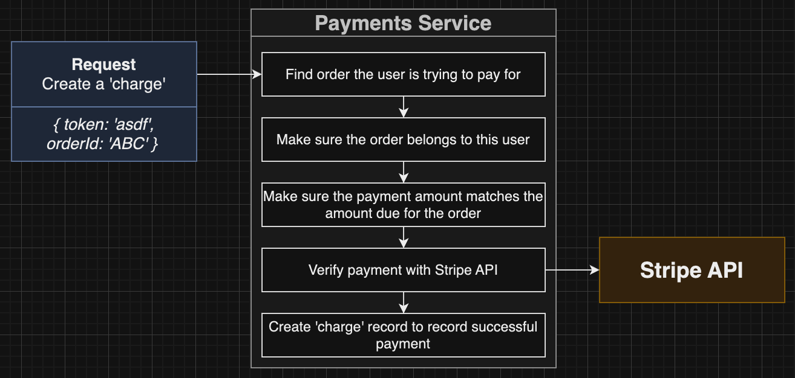
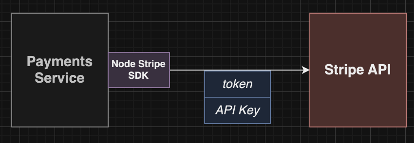
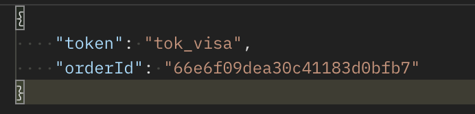
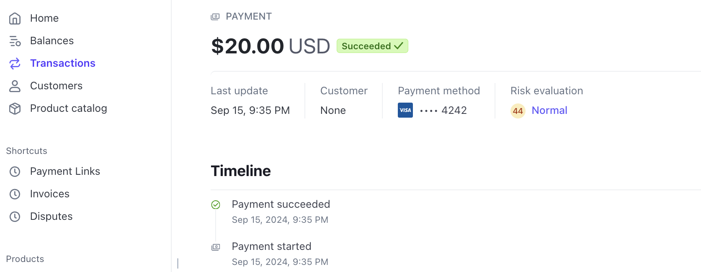

# Section 21: Handling Payments

## The Payments Service
[Link doc](https://app.diagrams.net/#G1d4FfpRRnGfb-zcj9erOkuZYZFdEIV7nG#%7B%22pageId%22%3A%22IAsZRB_BgFoqg9uK12g0%22%7D)


## Initial Setup
## Replicated Fields


## Another Order Model!
## Update-If-Current
## Replicating Orders
## Testing Order Creation
## Marking an Order as Cancelled
## Cancelled Testing
## Starting the Listeners


## Payments Flow with Stripe





## Implementing the Create Charge Handler


## Validating Order Payment
## Testing Order Validation Before Payment
## Testing Same-User Validation


## Stripe Setup
  
  *https://stripe.com/*

## Creating a Stripe Secret
  - Create secret in k8s

  ```bash
  kubectl create secret generic stripe-secret --from-literal STRIPE_KEY=<Secret key>
  ```


## [Deprecated]Creating a Charge with Stripe
  - Create charge is deprecated
  [link doc](https://docs.stripe.com/api/charges/create?lang=node)

  - Now using **PaymentIntent**
  [paymentintent](https://docs.stripe.com/api/payment_intents/create?lang=node)
  [quickstart](https://docs.stripe.com/payments/quickstart)

## Manual Testing of Payments
  - Fake token



## Automated Payment Testing
## Mocked Stripe Client
## A More Realistic Test Setup
## Realistic Test Implementation
[link video](https://www.udemy.com/course/microservices-with-node-js-and-react/learn/lecture/19826508)

## Tying an Order and Charge Together

## Testing Payment Creation

## Publishing a Payment Created Event

## More on Publishing

## Marking an Order as Complete

## Don't Cancel Completed Orders