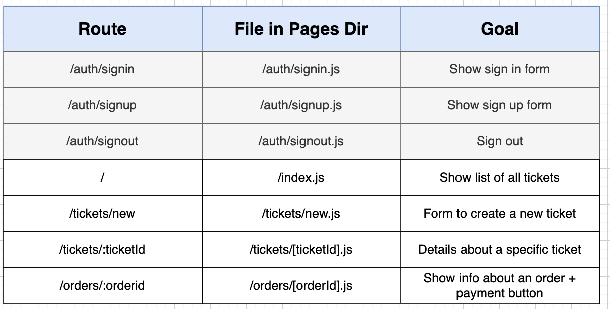
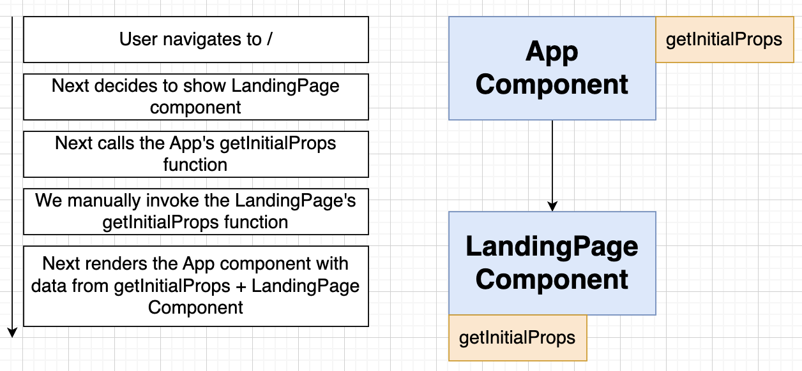

# Section 22: Back to the Client

## A Few Mode Pages

## Reminder on Data Fetching with Next

## Two Quick Fixes

## Scaffolding a Form

## Sanitizing Price Input

## Ticket Creation

## Listing All Tickets

## Linking to Wildcard Routes

## Creating an Order

## Programmatic Navigation to Wildcard Routes

## The Expiration Timer

## Displaying the Expiration

## Showing a Stripe Payment Form

## Module not found: Can't resolve 'prop-types'

## Configuring Stripe

## Test Credit Card Numbers

## Paying for an Order

## Filtering Reserved Tickets

## Header Links

## Rendering a List of Orders