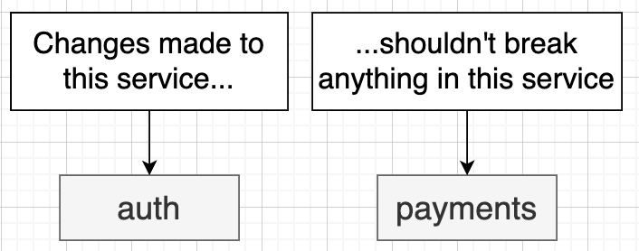

# Section 23: CI/CD

## Development Workflow


## Git Repository Approaches


## Creating a GitHub Action

  - [Link Doc](https://docs.github.com/en/actions/writing-workflows/choosing-when-your-workflow-runs/events-that-trigger-workflows)


## Adding a CI Test Script

## Tests in GitHub Actions Hang - Jest did not exit


## Running Tests on PR Creation
## Output of Failing Tests

## Running Tests in Parallel


## Verifying a Test Run

## Selective Test Execution

## Deployment Options
[link video](https://www.udemy.com/course/microservices-with-node-js-and-react/learn/lecture/19989400)

## Creating a Hosted Cluster

## Reminder on Kubernetes Context
  - Downloading digigal ocean cli
  [link install](https://docs.digitalocean.com/reference/doctl/how-to/install/)
  
  - Context
  
  

## Reminder on Swapping Contexts

## The Deployment Plan



## Building an Image in an Action
  [link tutorial](https://www.udemy.com/course/microservices-with-node-js-and-react/learn/lecture/19989430)
  - Create secrets on Gihub
  

## Testing the Image Build
  - After merge pull request from dev to master
  - Job run
  

## Restarting the Deployment
  
  - Get API_KEY/Access token from Digital ocean
  - Edit deploy/yaml
  ```yaml
  steps:
    ...
    - uses: digitalocean/action-doctl@v2
      with:
        token: ${{ secrets.DIGITALOCEAN_ACCESS_TOKEN }}
    - run: doctl kubernetes cluster kubeconfig save ticketing
    - run: kubectl rollout restart deployment auth-depl
  ```
  
## Applying Kubernetes Manifests

  - Create deploy-manifests.yaml in workflow
  ```yaml
  name: deploy-manifests
  on:
    push:
      branches:
        -  master
      paths:
        - 'infra/**'
  jobs:
    build:
      runs-on: ubuntu-latest
      steps:
        - uses: actions/checkout@v3
        - uses: digitalocean/action-doctl@v2
          with:
            token: ${{ secrets.DIGITALOCEAN_ACCESS_TOKEN }}
        - run: doctl kubernetes cluster kubeconfig save ticketing
        - run: kubectl apply -f infra/k8s && kubectl apply -f infra/k8s-prod
  ```

## Prod vs Dev Manifest Files

  - Folder k8s for every given cluster
  - Folder k8s-dev
  - Folder k8s-prod

## Manual Secret Creation
  - Create secrets JWT_TOKEN, STRIPE_KEY inside cluster on Digital Ocean

## Don't forget Ingress Nginx Controller installation
  - For Digital Ocean
  https://kubernetes.github.io/ingress-nginx/deploy/#digital-ocean

## Testing Automated Deployment
## Additional Deploy Files
## A Successful Deploy

## Buying a Domain Name
  
  - Load balancer was created automatically by Ingress and Gen X when we created it inside of our cluster.
  - Buy a domain name: namecheap.com

## Three Important Changes Needed to Deploy
  - [link changes](https://www.udemy.com/course/microservices-with-node-js-and-react/learn/lecture/27616972)
1. Update the baseURL in client service's build-client file:
2. Disable HTTPS Checking
3. Add Load Balancer


## Additional Features/Services To Build Next

