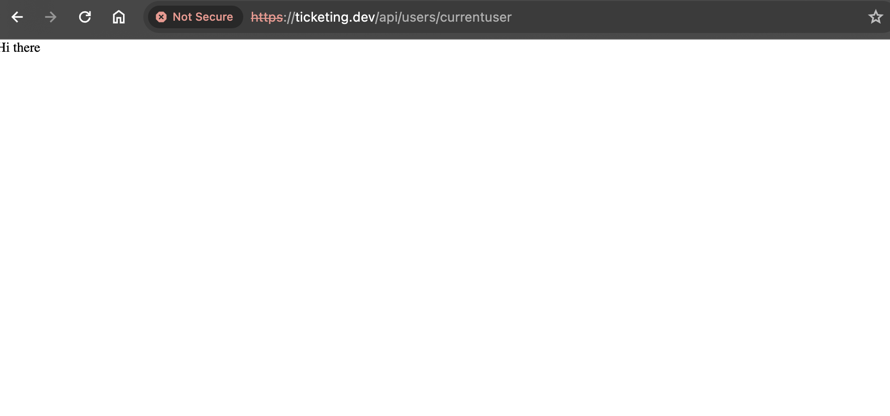

# Section 5: Architecture of Multi-Service Apps

## Setup Auth Service
```bash
npm install typescript ts-node-dev express @types/express
tsc --init

If you did not see your server restart after changing the index.ts file, do the following:
Open the package.json file in the ‘auth’ directory
Find the ‘start’ script
Update the start script to the following:

ts-node-dev --poll src/index.ts
```
Security Warning:


Reason: 
Type `thisisunsafe`
