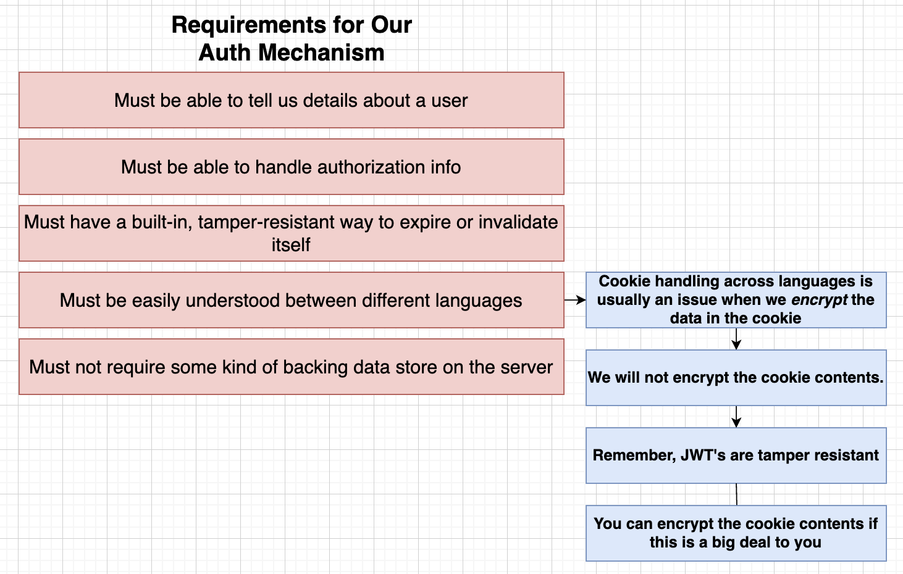

# Section 9: Authentication Strategies and Options

## Huge Issues with Authentication Strategies

## Solutions and Which one (Pros and Cons)?

## Microservices Auth Requirements

  - JWT and Cookie
  
  
  - JWT
  User can send the JWT request in headers, body, or cookies
  
  
  - Requirements for Our Auth Mechanism
  

## Issues with JWT's and Server Rendering

[Link doc](https://app.diagrams.net/#G1ZG5KtVPLoUBeHreC0YvpTEz9h763V5zr#%7B%22pageId%22%3A%22UtyN2U86ch3xbWobAUom%22%7D)

When authenticating JWT (JSON Web Tokens) with server-side rendering (SSR), several issues can arise:
1. Token Expiry:
Issue: JWTs have an expiration time. If a token expires during the SSR process, it can lead to authentication failures.
Solution: Implement token refresh mechanisms or handle token expiry gracefully.
Token Storage:
Issue: Storing JWTs securely on the server side can be challenging. Storing tokens in cookies can expose them to CSRF attacks.
Solution: Use HTTP-only cookies to store JWTs, which are not accessible via JavaScript.
3. Initial Page Load:
Issue: During the initial page load, the server needs to validate the JWT and fetch user data, which can add latency.
Solution: Optimize the authentication and data fetching process to minimize delays.
State Management:
Issue: Synchronizing the authenticated state between the server and client can be complex.
Solution: Ensure consistent state management by passing the authenticated state from the server to the client.
5. CSRF Protection:
Issue: JWTs stored in cookies are vulnerable to CSRF attacks.
Solution: Implement CSRF protection mechanisms, such as using CSRF tokens.
Token Revocation:
Issue: JWTs are stateless, making it difficult to revoke tokens if needed (e.g., after a user logs out).
Solution: Implement token blacklisting or use short-lived tokens with refresh tokens.
7. Error Handling:
Issue: Handling authentication errors (e.g., invalid or expired tokens) during SSR can be tricky.
Solution: Implement robust error handling and redirection mechanisms.
Security:
Issue: Ensuring the security of JWTs during transmission and storage is critical.
Solution: Use HTTPS to encrypt data in transit and secure storage mechanisms.
9. Performance:
Issue: JWT validation and user data fetching can impact server performance.
Solution: Optimize server-side code and consider caching strategies.
10. SEO Impact:
Issue: Authentication-related redirects and delays can impact SEO.
Solution: Ensure that public pages are accessible without authentication and optimize the SSR process.

## Cookies and Encryption


## Adding Session Support
```ts
app.set('trust proxy', true);
```
Purpose: This setting tells Express to trust the X-Forwarded-* headers, which are set by the reverse proxy to indicate the original client IP address, protocol, and other details.
Usage: This is particularly important for applications deployed behind a reverse proxy, as it allows Express to correctly identify the client's IP address and protocol (HTTP/HTTPS).

## Generating a JWT

[Decode tool](https://www.base64decode.org/)

## JWT Signing Key
[Link doc](https://app.diagrams.net/#G1-Dd9YYnqaUduYdklZe6CTOZ1moUh2gH-#%7B%22pageId%22%3A%22RIi8Pw8IikuQeiF8Qr2n%22%7D)


## Securely Storing Secrets with K8s


## Creating and Accessing Secrets
```bash
kubectl create secret generic jwt-secret --from-literal=JWT_KEY=asdasd
k get secrets
```

 - When error occurs, K8s create new pod to debug the error
 

## Accessing Env Variables in a Pod


## Common Response Properties
## Formatting JSON Properties
## Common Request Validation Middleware
## Current User Handler

 - Postman tips
  - Cookie can be saved and shared between domain even though different route
  

## Argumenting Type Definition
  ```typescript
  declare global {
    namespace Express {
      interface Request {
        currentUser?: UserPayload
      }
    }
  }
  ```

## Create middlewares for Current User and Require Auth
