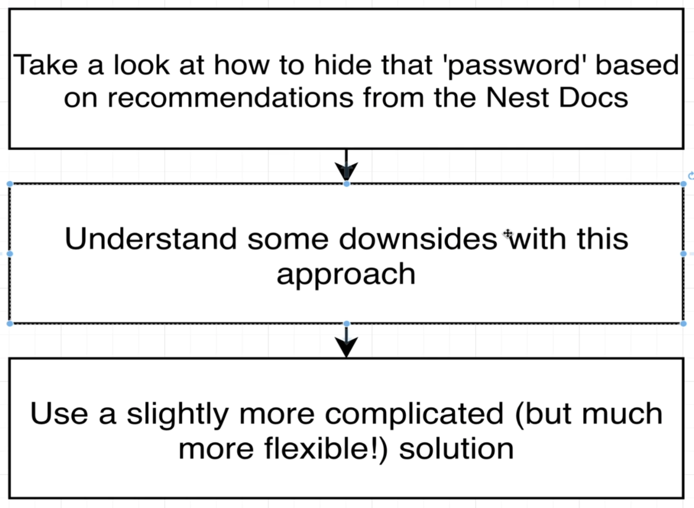
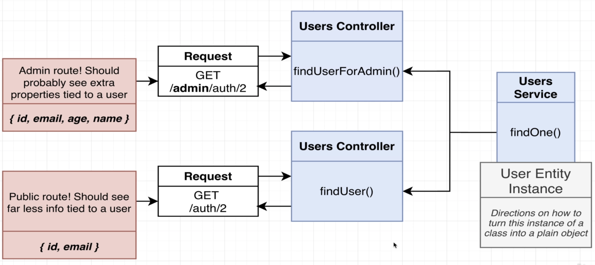
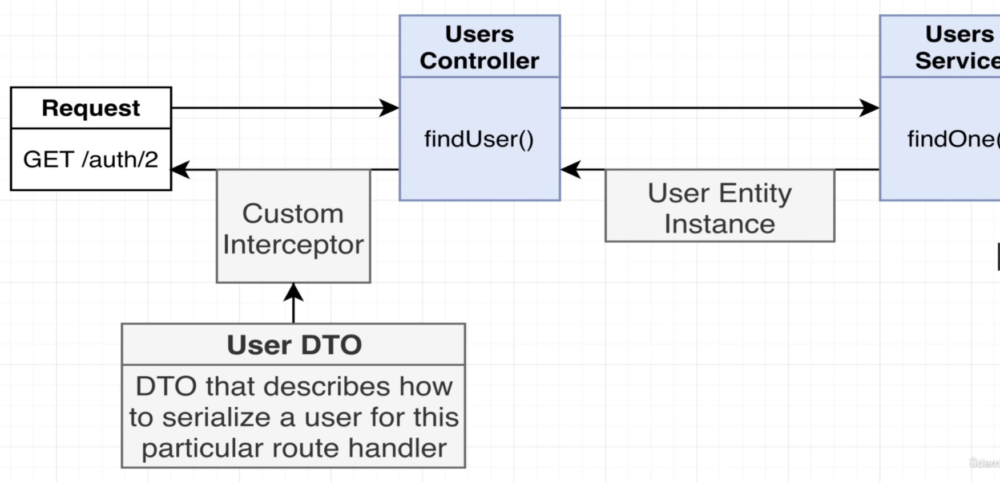
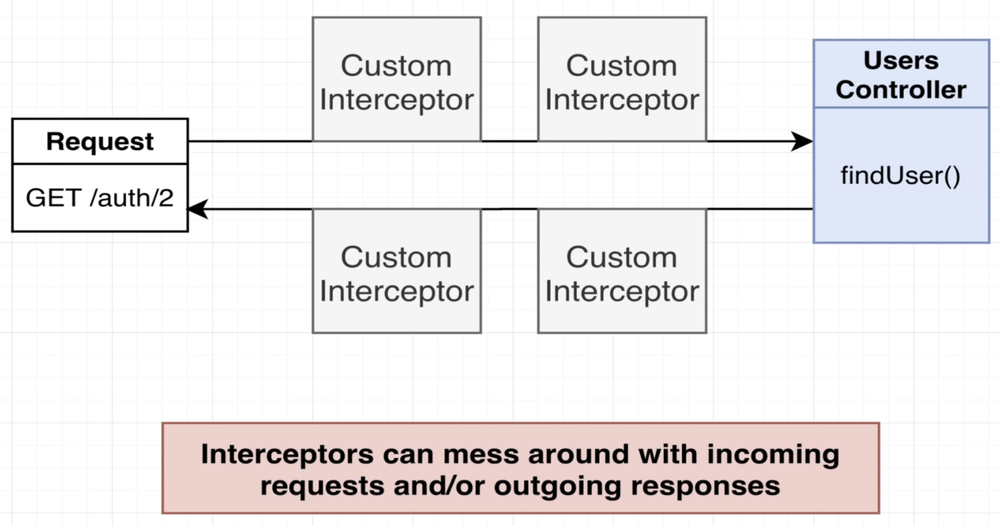
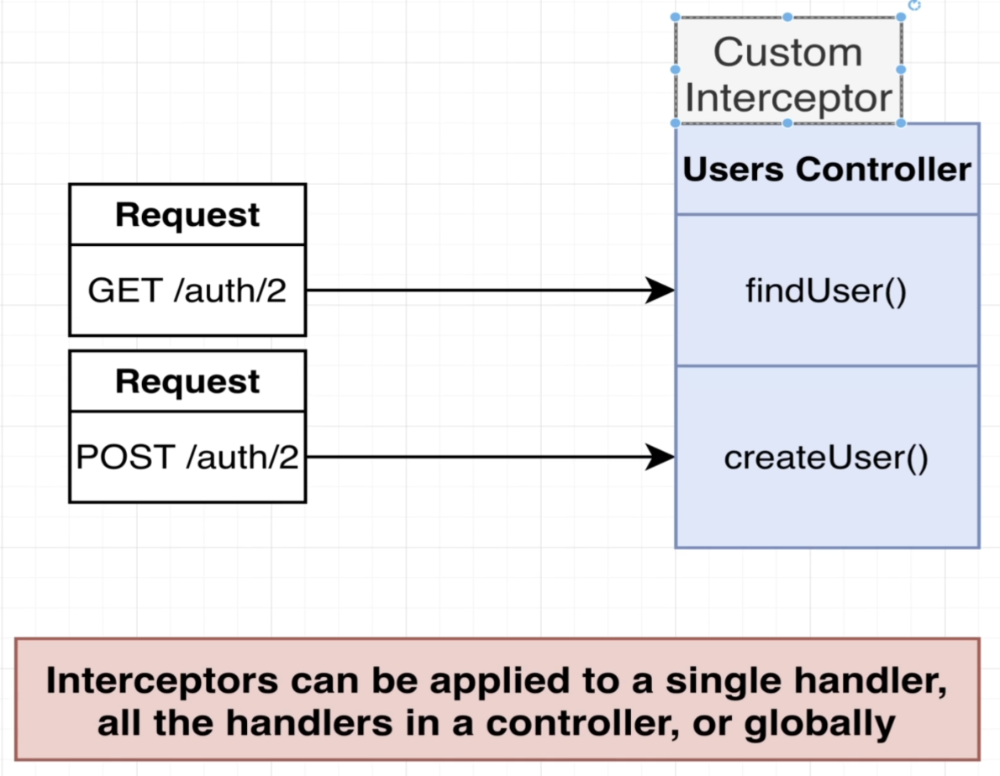
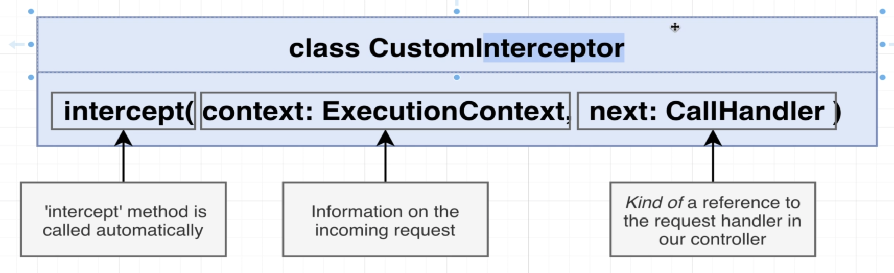
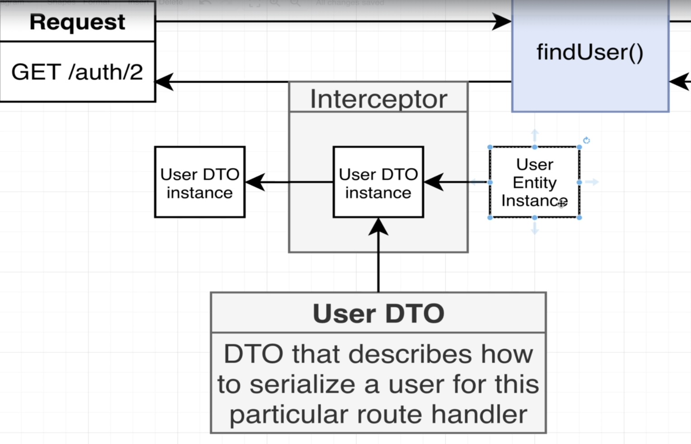

# Section 10: Custom Data Serialization

## Excluding Response Properties
  - Serialization
    - *https://docs.nestjs.com/techniques/serialization#exclude-properties*
  - 

## Solution to Serialization
  - Another cases:
  
    - Cannot using the Nest approach to serialize data
  
  - Using **Custom Interceptors**
  
    - *https://docs.nestjs.com/interceptors#interceptors*

## How to Build Interceptors
  - How to build custom interceptors
  - 
  - 
  - 

## Serialization in the Interceptor
  - Work with DTOs
  
  
  - Data Expose DTO
  ```typescript
  export class UserDto {
    // Decorator rules
    @Expose()
    id: number;

    @Expose()
    email: string;
  }
  ```

  - Interceptor class:
  ```typescript
  export class SerializeInterceptor implements NestInterceptor {
    intercept(
      context: ExecutionContext,
      next: CallHandler<any>,
    ): Observable<any> | Promise<Observable<any>> {
      // Run something before a request is handled by the request handler
      console.log('Im running before the handler...');

      return next.handle().pipe(
        map((data: any) => {
          // Run something before the respone is sent out
          return plainToClass(UserDto, data, {
            excludeExtraneousValues: true,
          });
        }),
      );
    }
  }
  ```

## Customizing the Interceptor's DTO
## Wrapping the Interceptor in a Decorator
## Controller-Wide Serialization
## A Bit of Type Safety Around Serialize
  - TypeScript doesn't really have great support for making use of types around decorators in general.
  ```typescript
  interface ClassContructor {
    new (...args: any[]): {};
  }
  ...
  function Serialize(dto: ClassContructor) {}
  ```