# Section 11: Authentication from Scratch

## Authentication Overview
  - *https://docs.nestjs.com/security/authentication*
  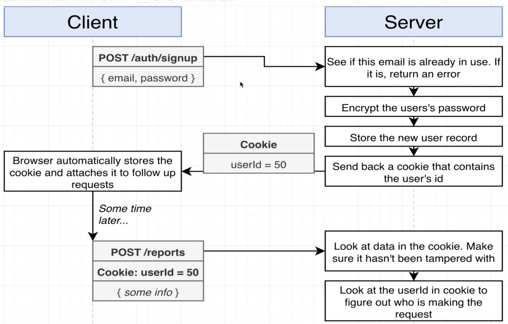 
  - Option 1
  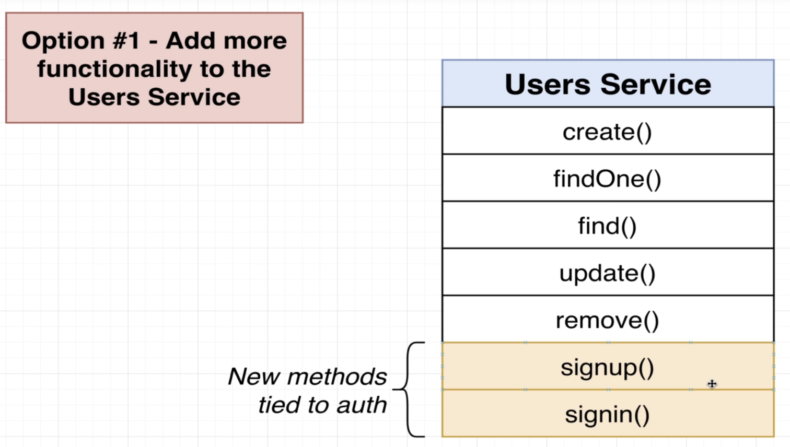

  - Option 2
  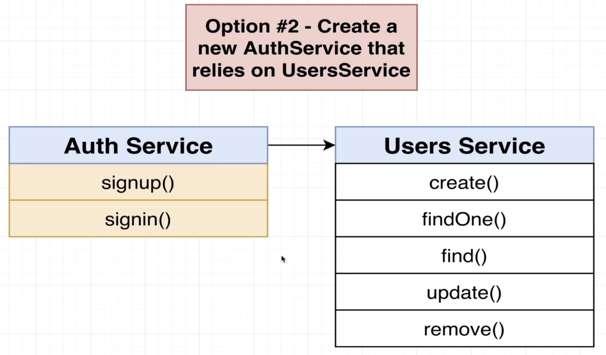

  - Problem with Option 1
  - Only apply to small project
  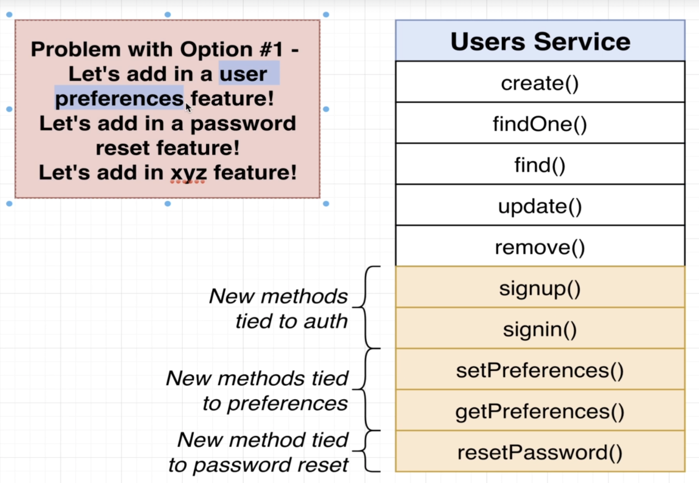

## Reminder on Service Setup
  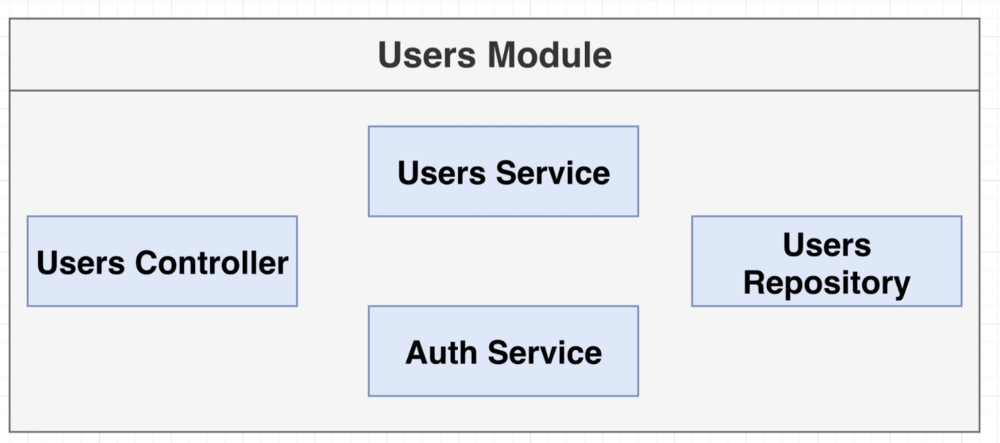

## Implementing Signup Functionality
## [Optional] Understanding Password Hashing
  - Rainbow Table Attack
  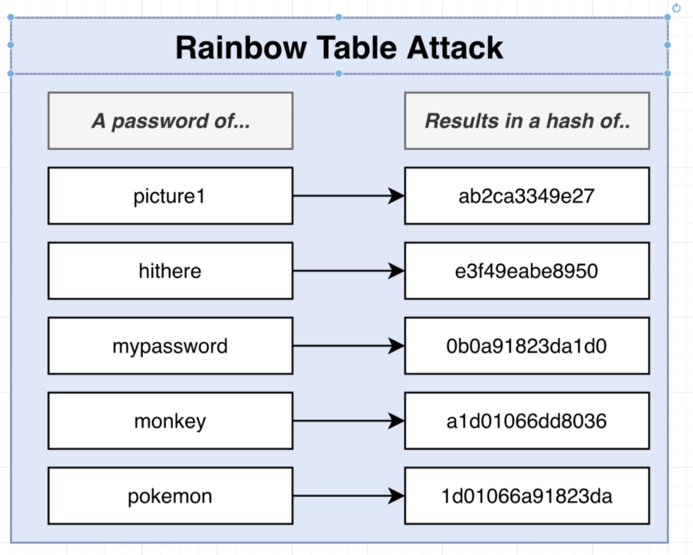

  - Salting can prevent rainbow attacks
  
  - Signup flow with salting
  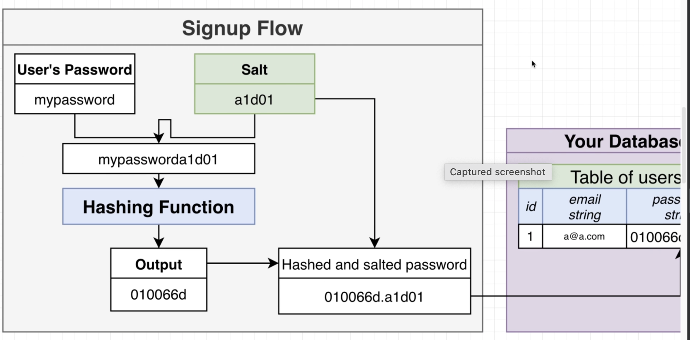

  - Signin flow with salting
  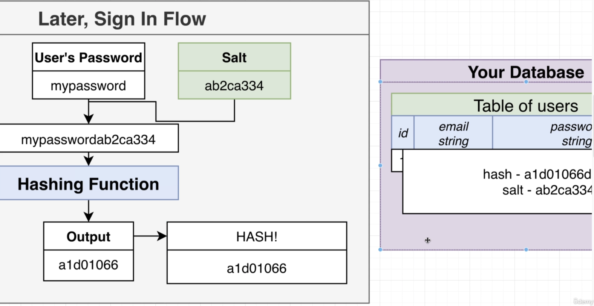

## Salting and Hashing the Password
  - *https://docs.nestjs.com/security/encryption-and-hashing*

## Creating a User
## Handling User Sign In

## Setting up Sessions
  - Session flow
  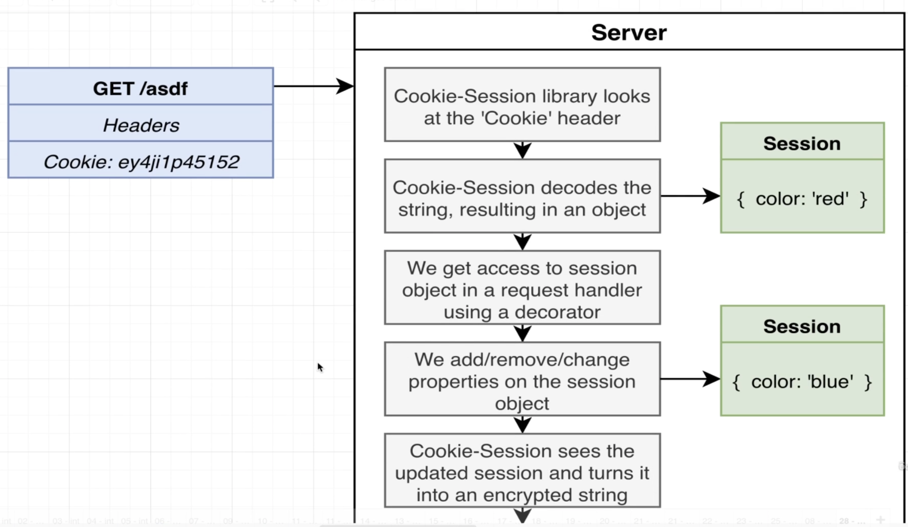
  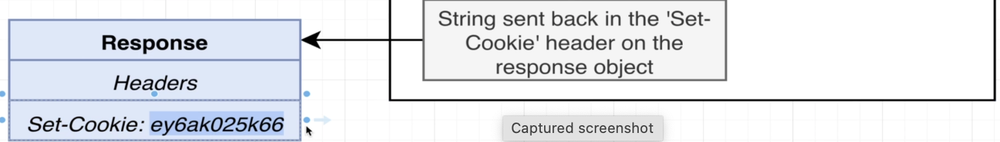


## Changing and Fetching Session Data
## Signing in a User
## Getting the Current User
## Signing Out a User
## Two Automation Tools
  - Reject request
  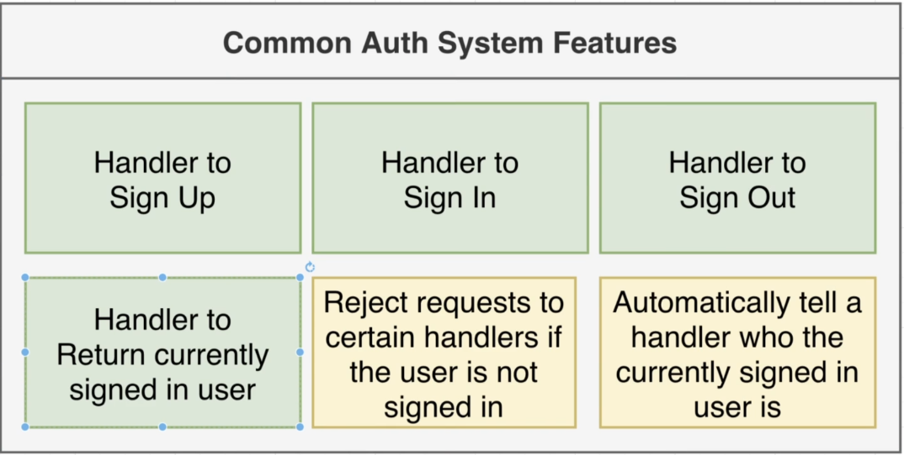

  - Current user handler
  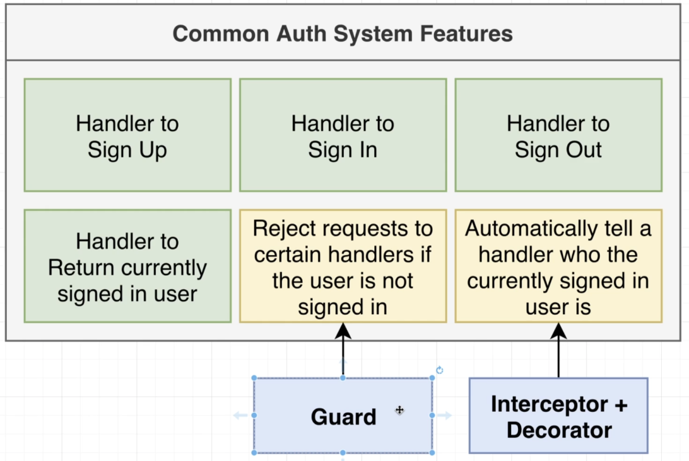

## Custom Param Decorators
  - Create a new decorator for return current user: `@CurrentUser`

  - Context in decorator:
  ```typescript
  // context(incoming request): allows us to write some code that might work equally well with WebSockets, gRPC, Http, GraphQL
  // or any other kind of communication protocol.
  export const CurrentUser = createParamDecorator(
    (data: any, context: ExecutionContext) => {
      return 'hi there';
    },
  );

  ```

## Why a Decorator and Interceptor
  - Kết hợp giữa decorator và interceptor để có thể sử dụng được Serivce trong DI Container
  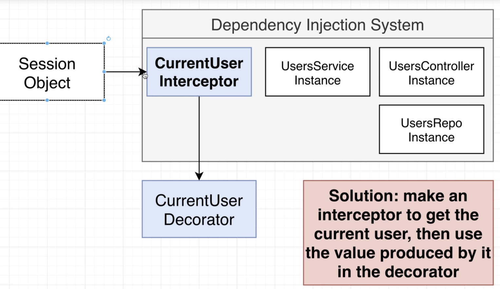

## Communicating from Interceptor to Decorator
  - Ở hình trên:
    - Vì interceptor được inject trong DI System nên có thể thao tác với lại Services, còn decorator thì KO
    - Chúng ta cần phải run interceptor trước để add user vào request trước khi decorator handle

## Connecting an Interceptor to Dependency Injection
## Globally Scoped Interceptors
  - *https://docs.nestjs.com/interceptors#binding-interceptors*
  - Refer: *https://docs.nestjs.com/fundamentals/custom-providers#non-class-based-provider-tokens*
  - Nhằm để tránh duplicate code decorators trong nhiều controller
  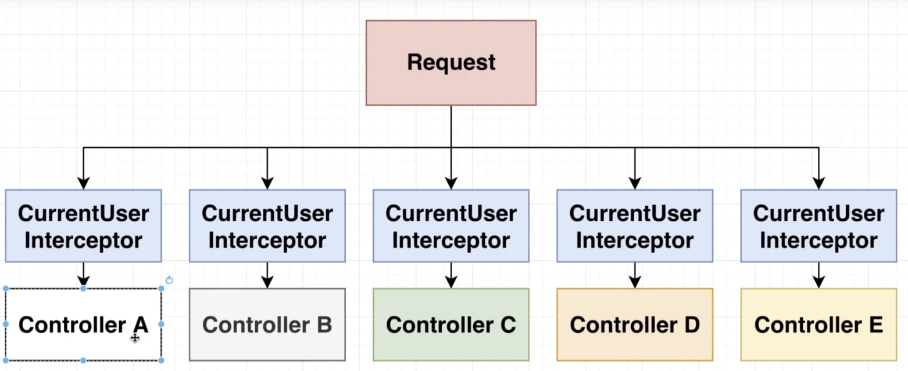
  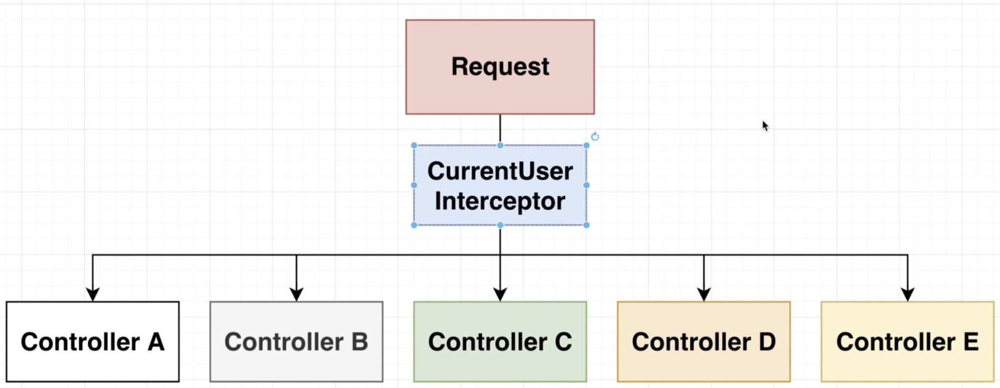
  
## Preventing Access with Authentication Guards
  - *https://docs.nestjs.com/guards*
  - 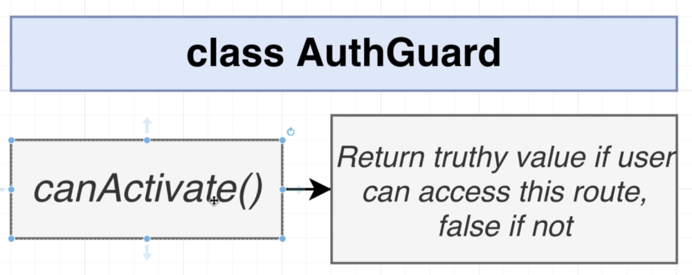
  - 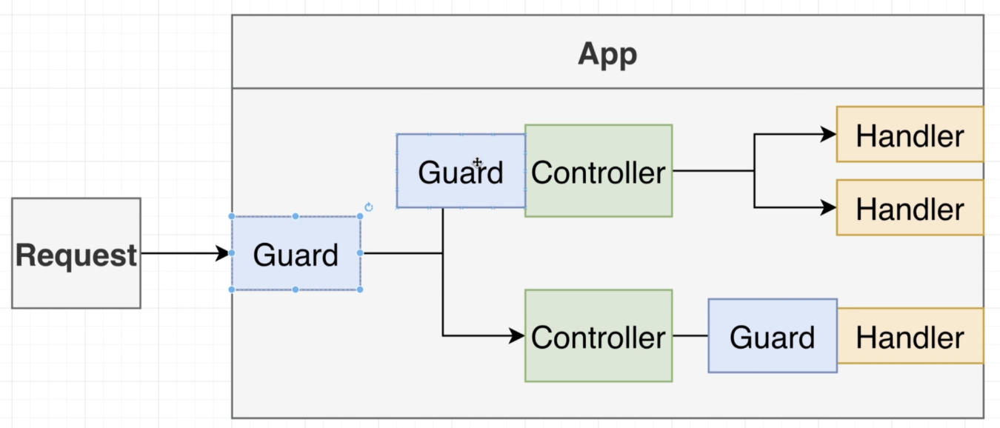