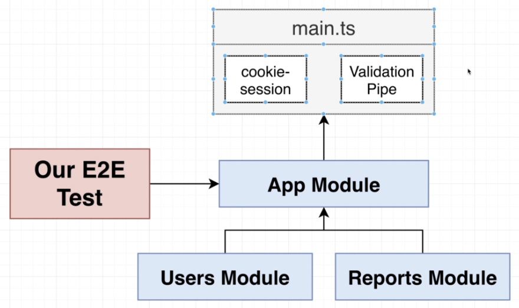

# Section 13: Integration Testing

## End to End Testing


## App Setup Issues in Sec files

  - Nest will not run the main.ts file when e2e run, just work with App Module
  - There are 2 ways to resolve this:
    - 1. Separate middleware in app setup
    ```typescript
    app.use(
      cookieSession({
        keys: ['dddddd'],
      }),
    );
    app.useGlobalPipes(
      new ValidationPipe({
        // whitelist: true strip out all property in the body not in dto
        whitelist: true,
      }),
    );
    ```
    - 2. Nest official way: ⬇️
## Applying a Globally Scoped Pipe
  - Move Pipes, middlewares,... into the App Module
  
  - *https://docs.nestjs.com/pipes#global-scoped-pipes*

## Applying a Globally Scoped Middleware
  - *https://docs.nestjs.com/middleware#middleware-consumer*

## Creating Separate Test and Dev Databases
  
  
  