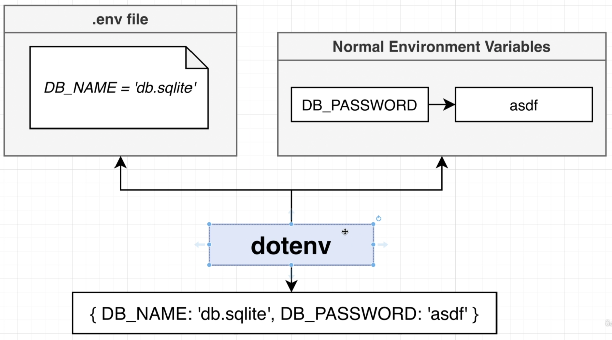
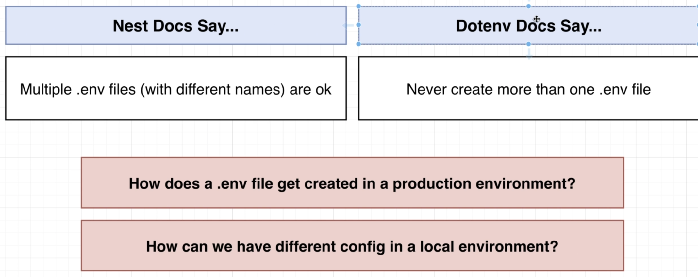
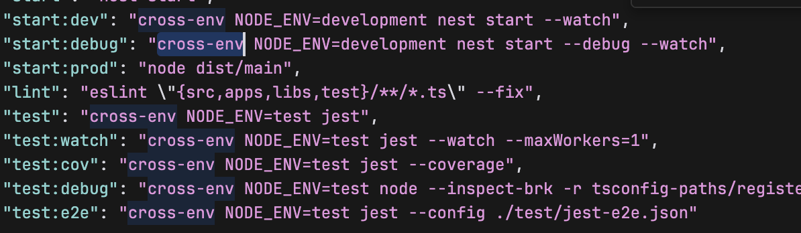
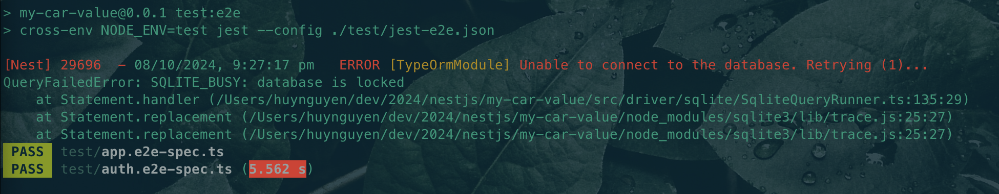

# Section 14: Managing App Configuration

## Understanding Dotenv
```bash
  npm i @nestjs/config
```
  - `dotenv` package (plain Javascript library)
  
  
  - *https://docs.nestjs.com/techniques/configuration#installation*

## Applying Dotenv for Config
## Specifying the Runtime Environment
  ```bash
  npm i cross-env
  ```
  - Use this module to use environment variables with different platforms
  

## Solving a SQLite Error

  - Lỗi này là vì jest luôn luôn chạy đồng thời các file e2e test, nhưng SQLite lại ko support multiple connection

## Delete test.sqlite before executing test file
  - jest-e2e.json
```json
{
  ...
  "setupFilesAfterEnv": ["<rootDir>/setup.ts"]
}
```