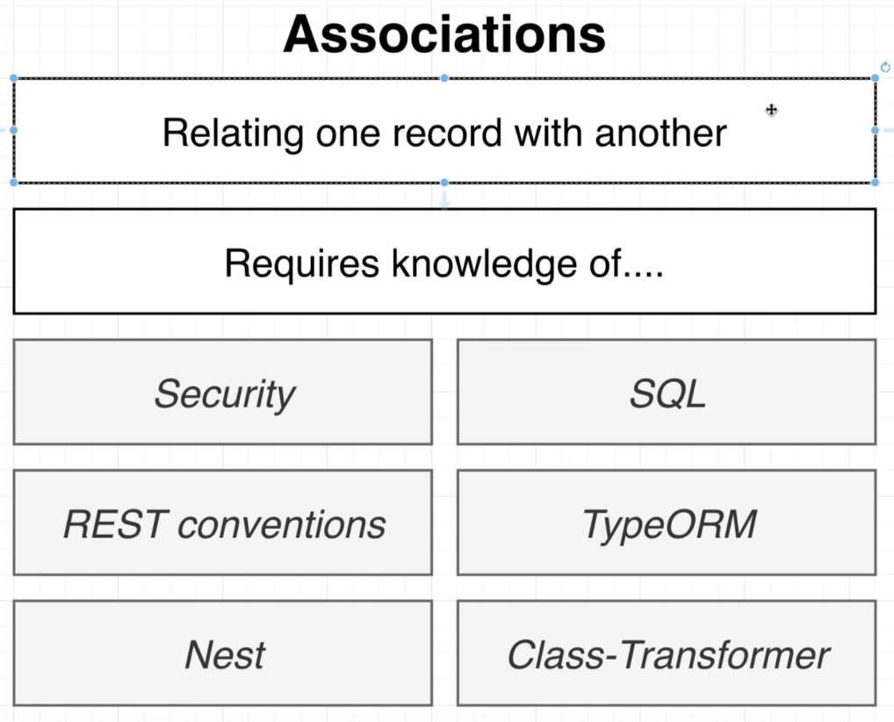
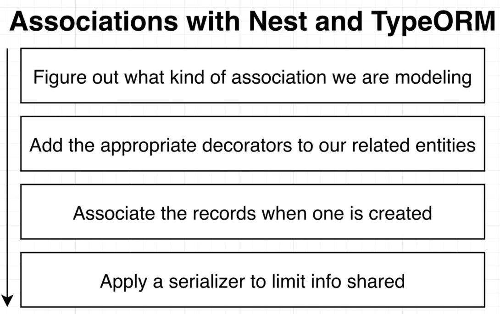
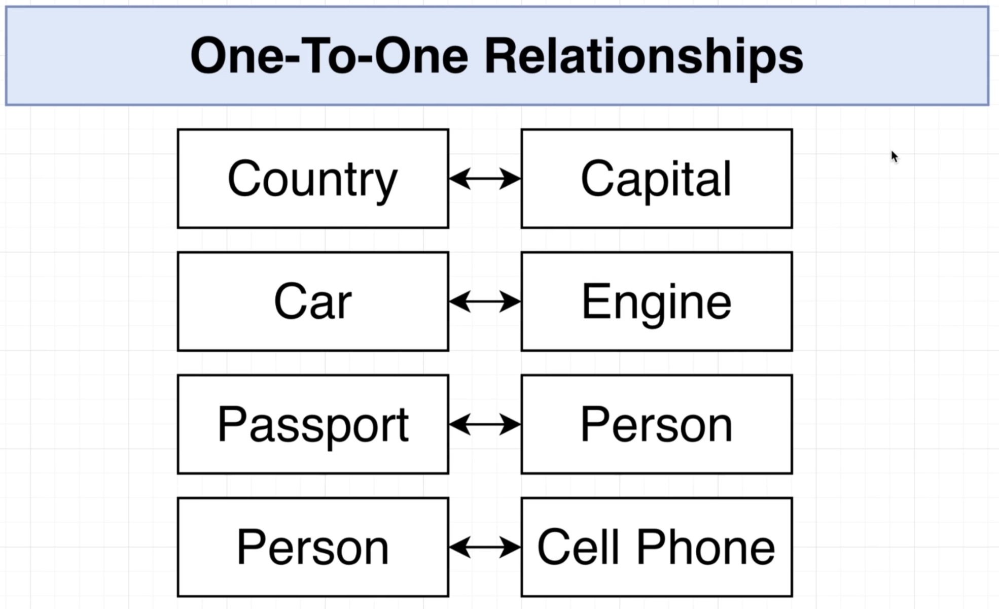
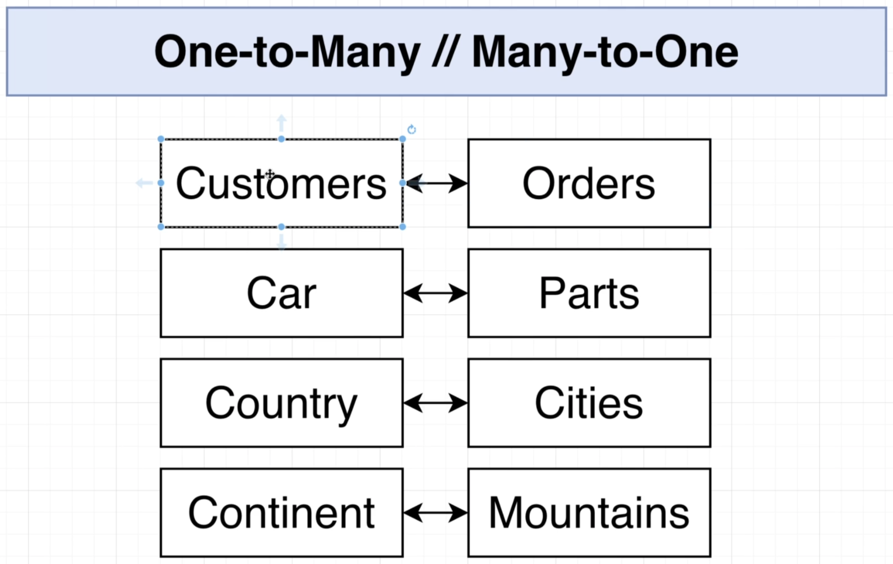
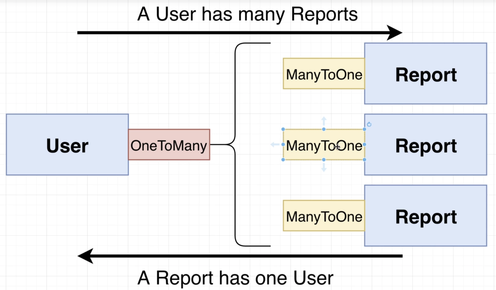
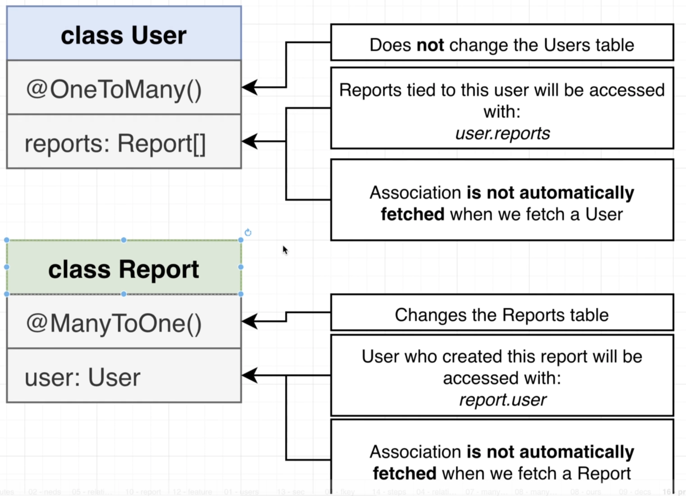

# Section 15: Relations with TypeORM

## Back to Reports
## Adding Properties to Reports
## A DTO for Report Creation
## Receiving Report Creation Requests
## Saving a Report with the Reports Service
## Testing Report Creation
## Building Associations
  - 
  - Steps to build associations with Nest and TypeORM
  
## Types of Associations
  
  
  

## The ManyToOne and OneToMany Decorators
  - *https://docs.nestjs.com/techniques/database#relations*
  - Typeorm docs: *https://typeorm.io/relations*

## Important Note About Deleting Database
## More on Decorators
  - 
  ```typescript
  // first argument explaination:
  // solve the circular dependency by wrapping User in a function, make sure User was defined before executing
  // second argument:
  // inverse side: indicate what property in the relationship
  @ManyToOne(() => User, (user) => user.reports)
  user: User;
  ---
  @OneToMany(() => Report, (report) => report.user)
  reports: Report[];
  ```

## Setting up the Association
## Formatting the Report Response
## Transforming Properties with a DTO
  ```typescript
  @Transform(({ obj }) => obj.user.id)
  @Expose()
  userId: number;
  ```
