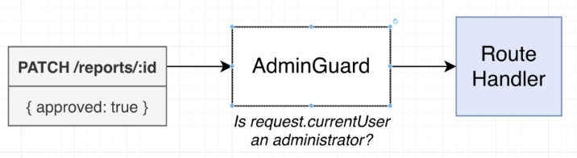
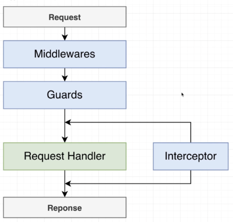
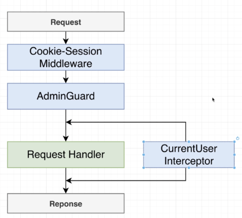
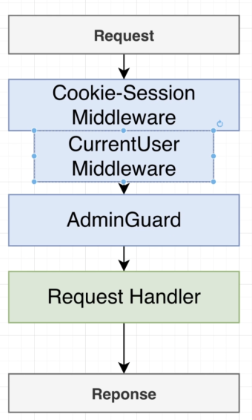
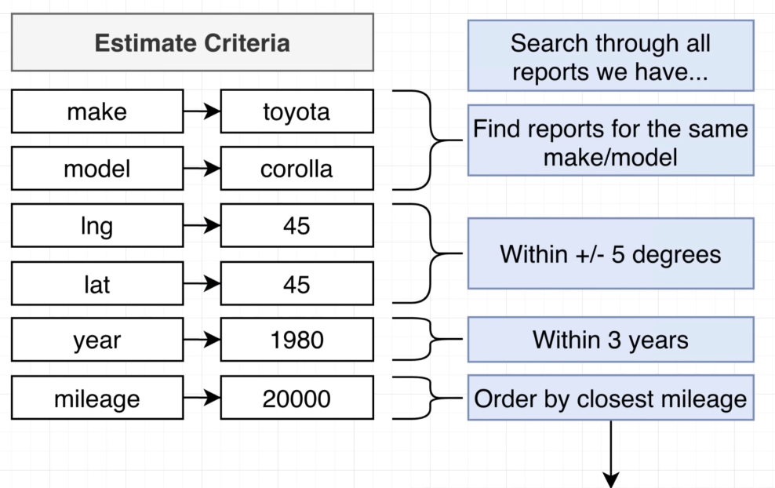
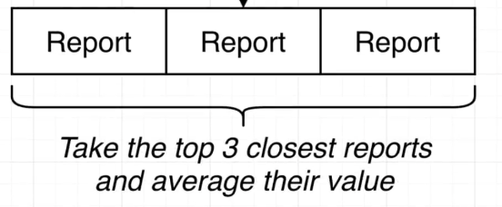

# Section 16: A Basic Permissions System

## Adding in Report Approval
## Required Update for changeApproval Method
## Testing Report Approval
## Authorization vs Authentication
## Adding an Authorization Guard
  - Create a new admin guard for the authorization

## The Guard Doesn't Work?!
## Middlewares, Guards, and Interceptors
  - Lifecycle between middlewares, guards and interceptors
  
  
  - Because we can not get the currentuser from current-user.interceptor, the solution is: turn the interceptor into middleware.
  

## Assigning CurrentUser with a Middleware
  - Apply current user middleware
  - *https://docs.nestjs.com/middleware#middleware*

## Fixing a Type Definition Error
## Validating Query String Values
## Transforming Query String Data
## How Will We Generate an Estimate

