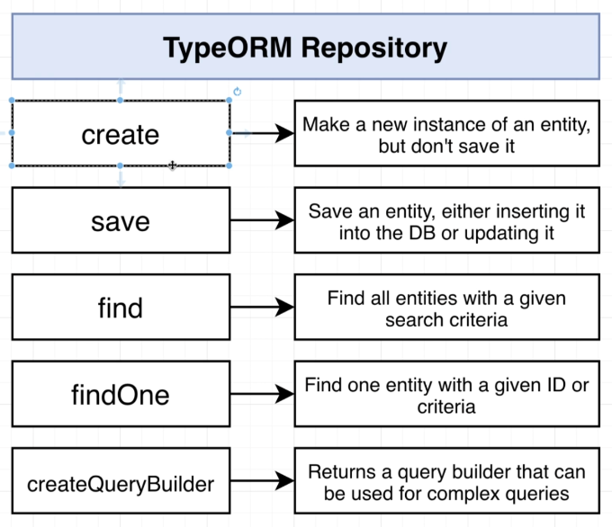

# Section 17: Query Builders with TypeORM

## Creating a Query Builder
  - QueryBuilder in TypeORM
  *https://typeorm.io/select-query-builder#what-is-querybuilder*
  - 
  - Code example:
  ```typescript
  return this.repo
      .createQueryBuilder()
      .select('AVG(price)', 'price')
      .where('make = :make', { make })
      .andWhere('model = :model', { model })
      .andWhere('lng - :lng BETWEEN -5 AND 5', { lng })
      .andWhere('lat - :lat BETWEEN -5 AND 5', { lat })
      .andWhere('year - :year BETWEEN -3 AND 3', { year })
      .andWhere('approved IS TRUE')
      .orderBy('ABS(mileage - :mileage)', 'DESC')
      .setParameters({ mileage })
      .limit(3)
      .getRawOne();
  ```
## Writing a Query to Produce the Estimate
## Testing the Estimate Logic
