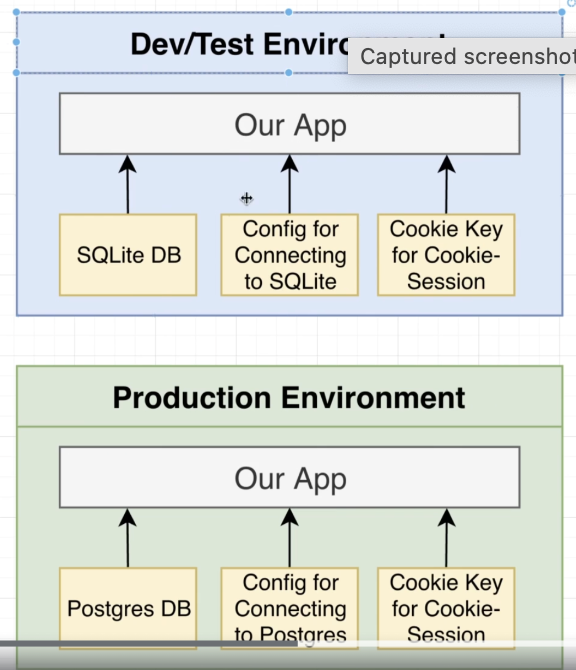
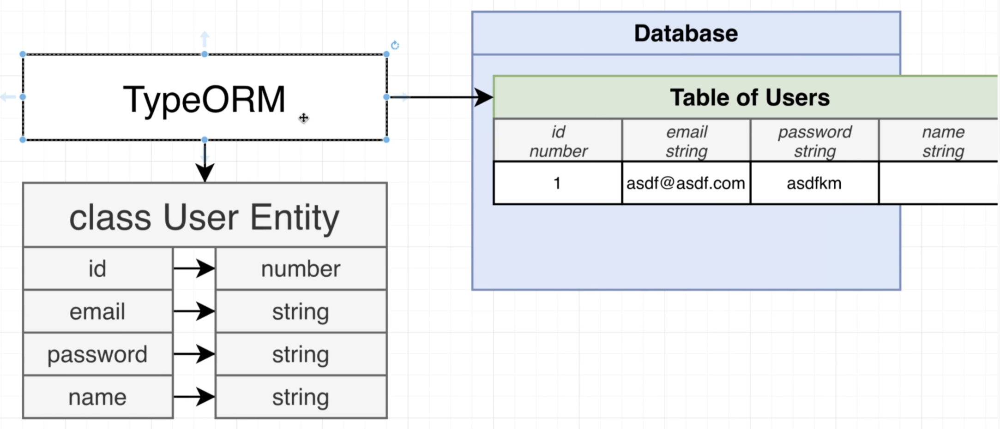
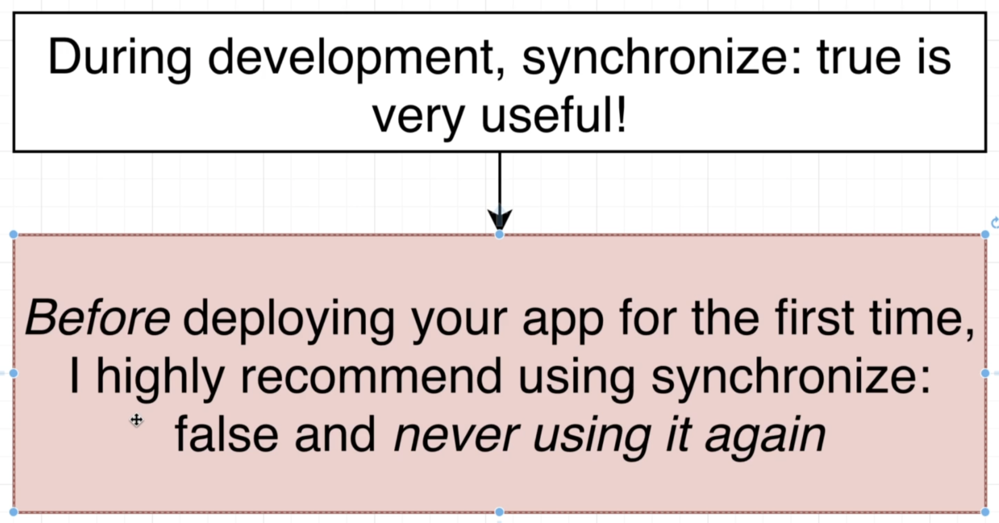
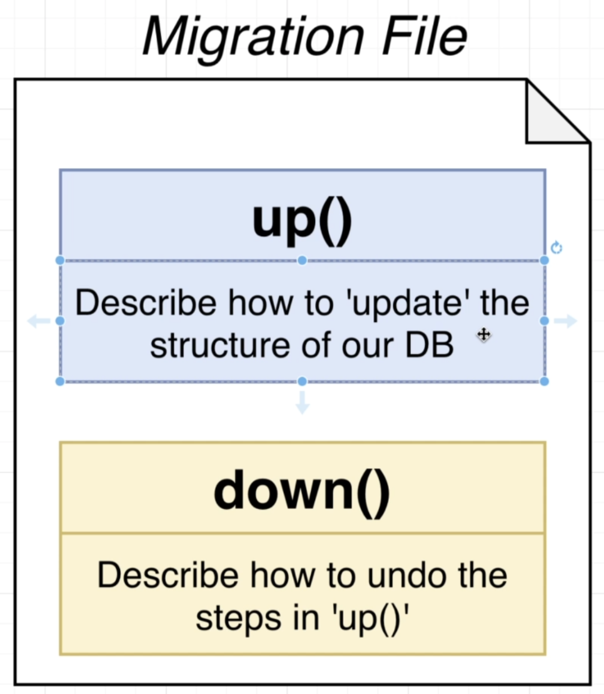
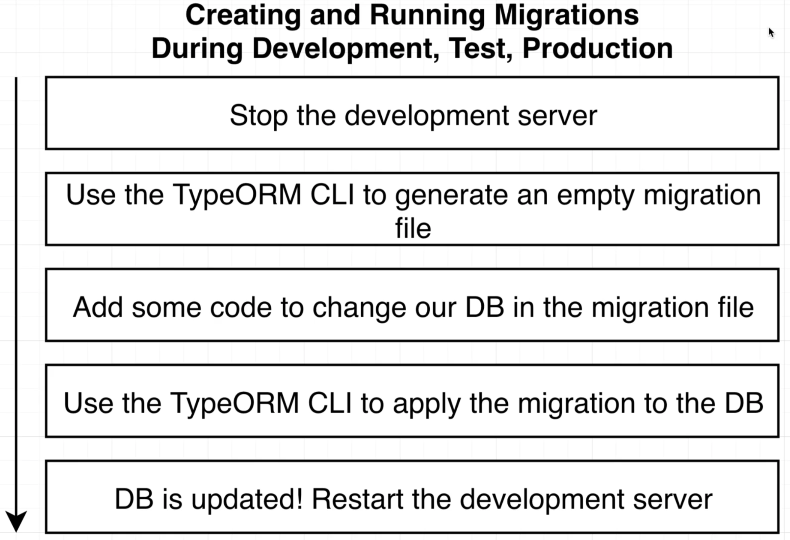
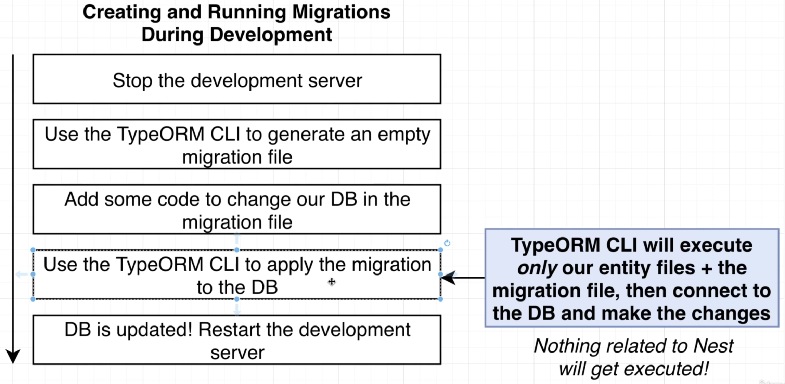
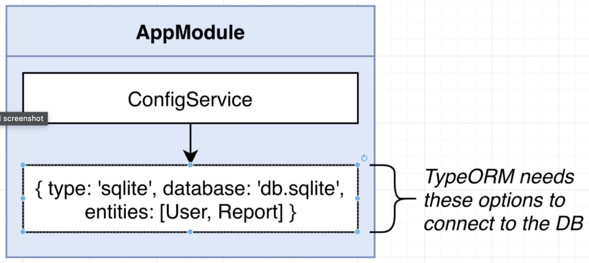
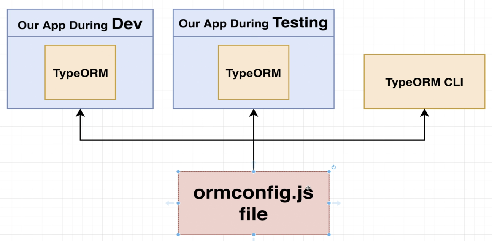
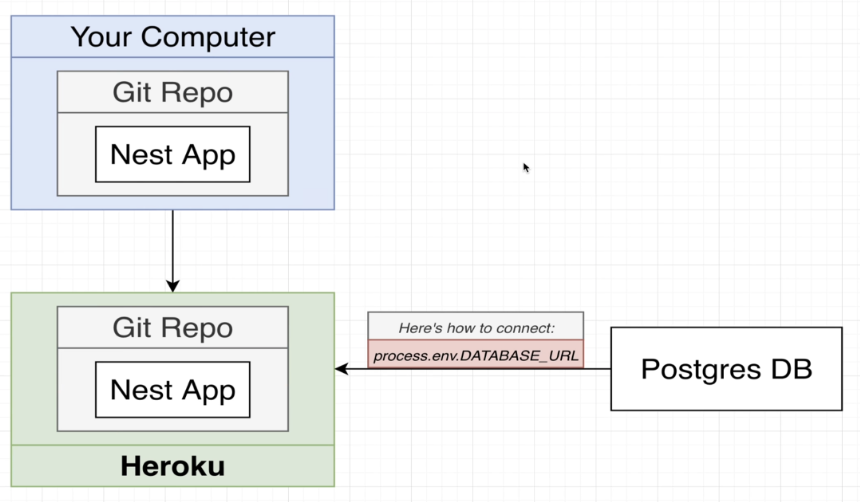

# Section 18: Production Deployment

## The Path to Production
  - Set different DB and cookie key on production


## Providing the Cookie Key
  - Không thể để lộ thông tin của cookie key

## Understanding the Synchronize Flag
  ```typescript
      TypeOrmModule.forRootAsync({
        inject: [ConfigService],
        useFactory: (config: ConfigService) => {
          return {
            type: 'sqlite',
            database: config.get<string>('DB_NAME'),
            entities: [User, Report],
            synchronize: true,
          };
        },
      }),
  ```
  - Explain about field: `synchronize: true`
  - Khi giao tiếp với db, TypeORM sẽ quan sát class Entity để cập nhật db đồng bộ với lại db, nếu field đã xóa hoặc được thêm, thì nó sẽ tự động thao tác tương ứng trong db
  - ===> DANGEROUS MANNER
  

## The Dangers of Synchronize
  - Trong quá trình phát triển có thể dùng field này, nhưng trên production TUYỆT ĐỐI không được dùng vì sẽ bị mất dữ liệu trên production
  - Câu hỏi: Nếu muốn update db (del, create, update) column, table thì ntn?
  - ==> Dùng MIGRATION
  - 

## The Theory Behind Migrations
  - 

## Headaches with Config Management
  - Thực hiện migration trên ứng dụng Nest rất challenging
  - Trong quá trình migration, chỉ có TypeORM và db, Nest ko tham gia
  - Nhưng những config thì nằm ở Nest nên TypeORM cần phải có để connect với DB
  
  
  

## TypeORM and Nest Config is Great
## Env-Specific Database Config
## Installing the TypeORM CLI
  
  - **How to create ormconfig/datasource in TypeORM**
    1. Create the `ormconfig.ts` file
    2. Export DataSource instance
      ```typescript
      import { DataSource, DataSourceOptions } from 'typeorm';

      const dbConfig = {
        synchronize: false,
      } as DataSourceOptions;

      switch (process.env.NODE_ENV) {
        case 'development':
          Object.assign(dbConfig, {
            type: 'sqlite',
            database: 'db.sqlite',
            entities: ['dist/**/*.entity{.ts,.js}'],
            migrations: [__dirname + '/migrations/*{.ts,.js}'],
          });
          break;
        case 'test':
          Object.assign(dbConfig, {
            type: 'sqlite',
            database: 'test.sqlite',
            entities: ['**/*.entity{.ts,.js}'],
            migrations: [__dirname + '/migrations/*{.ts,.js}'],
            migrationsRun: true,
          });
          break;
        case 'production':
          break;
        default:
          throw new Error('unknown environment');
      }
      console.log(dbConfig);
      export const AppDataSource = new DataSource(dbConfig);
      ```
    3. Import AppDataSource option in `app.module.ts` file:
      ```ts
      import { AppDataSource } from '../ormconfig';
      ...
      imports: [
          ...
          TypeOrmModule.forRoot(AppDatasource.options),
          ...
      ...
      ```
    4. Installing TypeORM CLI
      - In scripts `package.json` file:
      ```json
      "scripts": {
        ...
        "typeorm": "cross-env NODE_ENV=development typeorm-ts-node-commonjs -d ./ormconfig.ts"
      }
      ```

## Generating and Running Migrations
  - Run Migrations command:
  ```json
    "scripts": {
      "migration:generate": "npm run typeorm migration:generate",
      "migration:up": "npm run typeorm -- migration:run",
      "migration:down": "npm run typeorm -- migration:revert"
    }
  ```
  ```bash
    npm run migration:generate ./migrations/<migration-name>
    npm run migration:up
    npm run migration:down
  ```

## Running Migrations During E2E Tests
  - Don't forget add `migrationsRun: true` in datasource option in `test` env
## Refer doc for orm config and migration:
  - *https://typeorm.io/migrations#creating-a-new-migration*
  - *https://typeorm.io/using-cli#installing-cli*
  - *https://stackoverflow.com/questions/71803499/typeorm-when-trying-to-run-migrations-missing-required-argument-datasource*

## Required Migration Update for Production
  - Using QueryBuilder to generate table in `migration` file
  - *https://www.udemy.com/course/nestjs-the-complete-developers-guide/learn/lecture/27738758#questions/20669290*
## Production DB Config
  
## Heroku CLI Setup Instructions
  - *https://devcenter.heroku.com/articles/getting-started-with-nodejs#set-up*
## Heroku Specific Project Config
  - *https://www.udemy.com/course/nestjs-the-complete-developers-guide/learn/lecture/27738796#questions/20669290*
## Deploying the App - (Final Lecture)
  - *https://www.udemy.com/course/nestjs-the-complete-developers-guide/learn/lecture/30500838#questions/20669290*