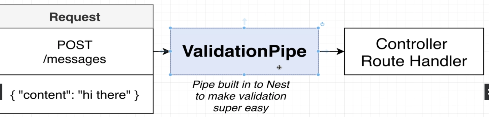
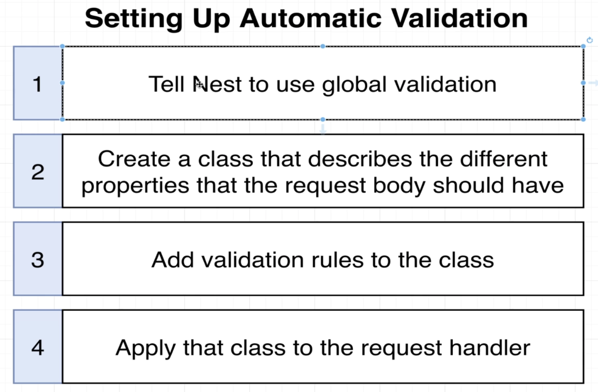
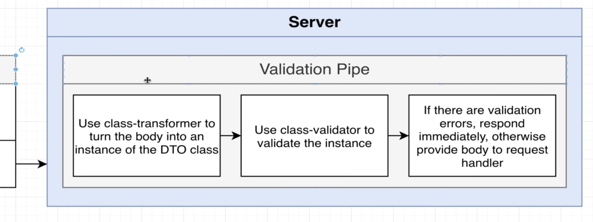

# Section 4: Validating Request Data with Pipes Decorators

## Use Global Validation Pipe


## Adding Validation Rules

  - DTO: Data Transfer Object

  - Class validator and class transformer
  *https://github.com/typestack/class-transformer?tab=readme-ov-file#what-is-class-transformer*
  *https://github.com/typestack/class-validator*

  ```bash
  npm install class-validator class-transformer
  ```

  

## Behind the scenes of Validation
  

## How Type Info is Preserved

*https://www.udemy.com/course/nestjs-the-complete-developers-guide/learn/lecture/27441316*
