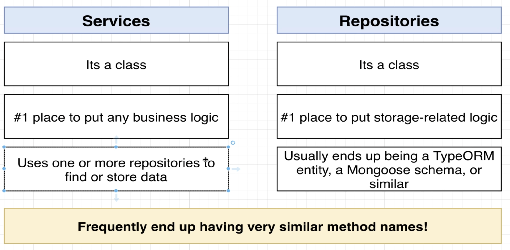

# Section 5: Nest Architecture: Services and Repositories

## Services and Repositories
  

## Implementing a Repository
## Reading and Writing to a Storage File
## Implementing a Service
## Manual Testing of the Controller
## Reporting Errors with Exceptions

## Understanding Inversion of Control
## Introduction to Dependency Injection
  
  

## Refactoring to Use Dependency Injection
## Few More Notes on DI