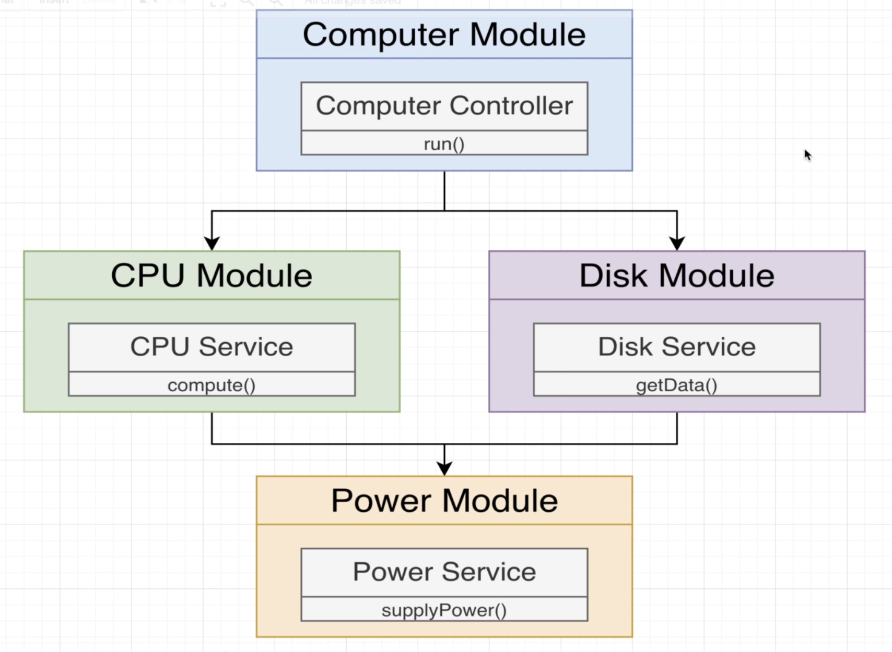

# Section 6: Nest Architecture: Organizing code with Modules

## Overview 

## Setting up DI between Modules

  - DI inside of a module
  

  - DI between modules
  

## More on DI between Modules
## Consuming Multiple Modules
## Modules Wrappup
  - Không phải Nest tạo ra nhiều DI Container mà chỉ có 1 DI container duy nhất nhưng sẽ có nhiều scope trong đó
