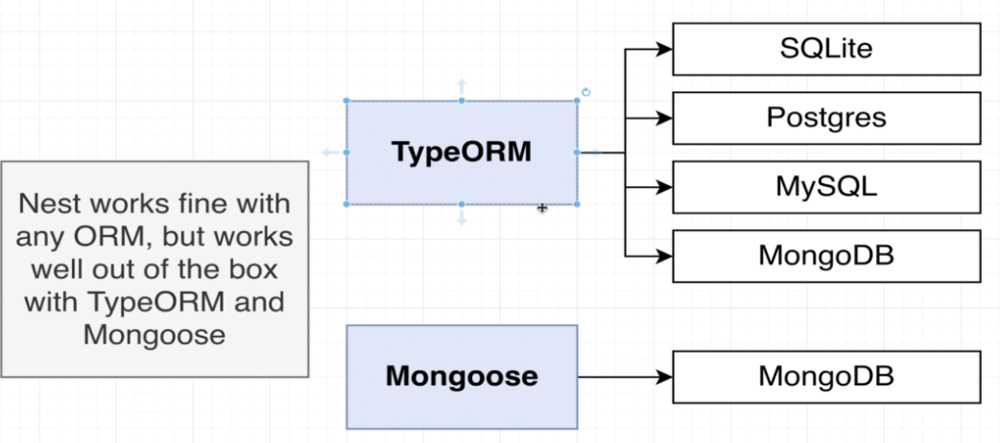
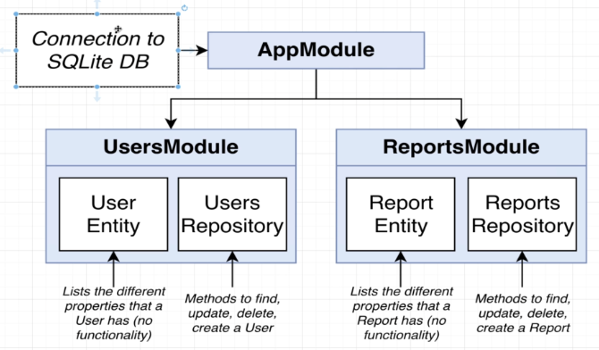
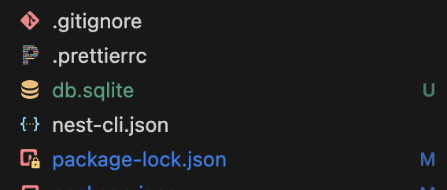
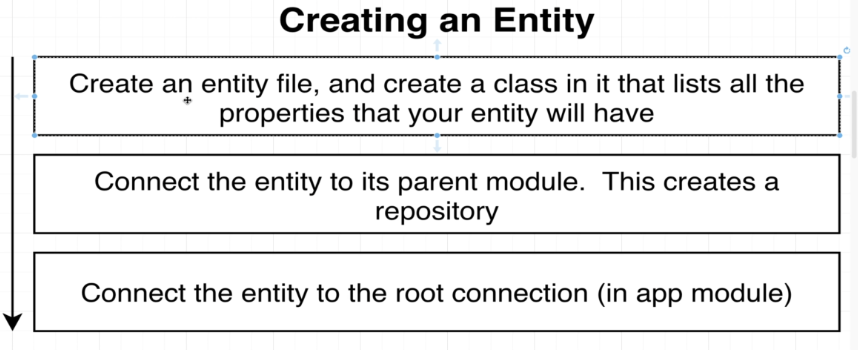
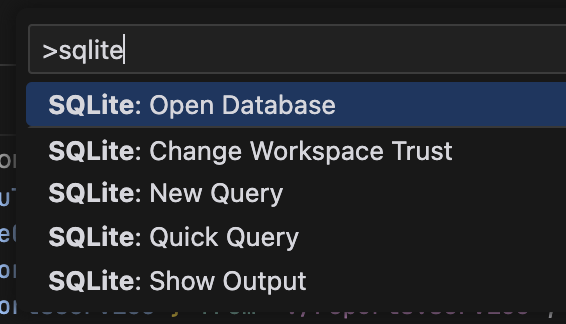
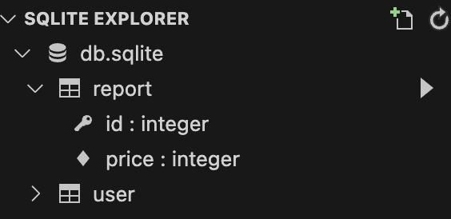
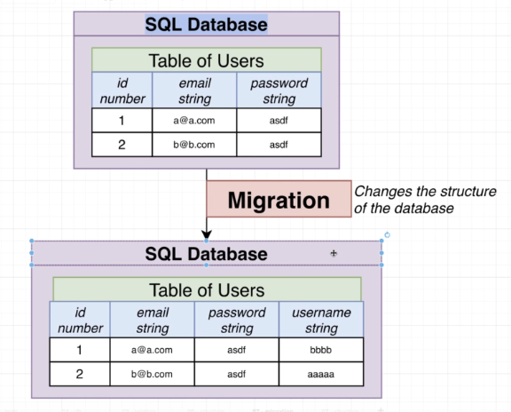
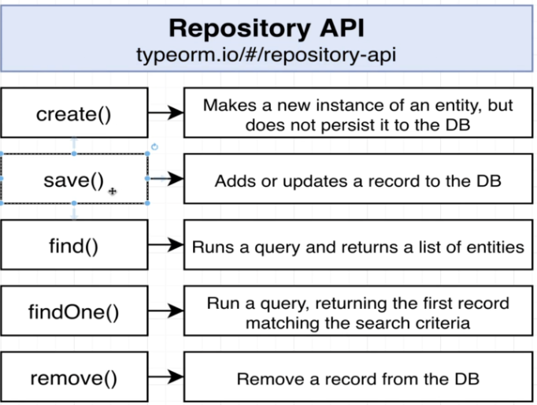

# Section 8: Persisting Data with TypeORM

## Persistent Data with Nest
  - Install typeorm and sqlite3
```bash
  npm install @nestjs/typeorm typeorm sqlite3
```

## Setting Up a Database Connection
  - ORM with Nest


## Creating an Entity and Repository
  - Connecting to db in app module
  
  
  - Setup TypeOrmModule in app module
  ```typescript
  imports: [
    TypeOrmModule.forRoot({
      type: 'sqlite',
      database: 'db.sqlite',
      entities: [],
      synchronize: true,
    }),
  ]
  ```
  - Nest automatically creates db.sqlite file to save raw data
  

  - Steps to create Entity
  

## Viewing a DB's Contents
  - Using extension to view db content
  
  
  

## Understanding TypeORM Decorators

  - Just using synchronize in development env, NOT on PRODUCTION
  `synchronize: true,`: typeorm automatically look at the structure of all diff entities and then update the structure of the database.

  - Migration (we must create)
  


## One Quick Note on Repositories
  - *https://typeorm.io/repository-api#repository-apis*
  

## A Few Extra Routes
## Setting Up Body Validation
## Manual Route Testing
