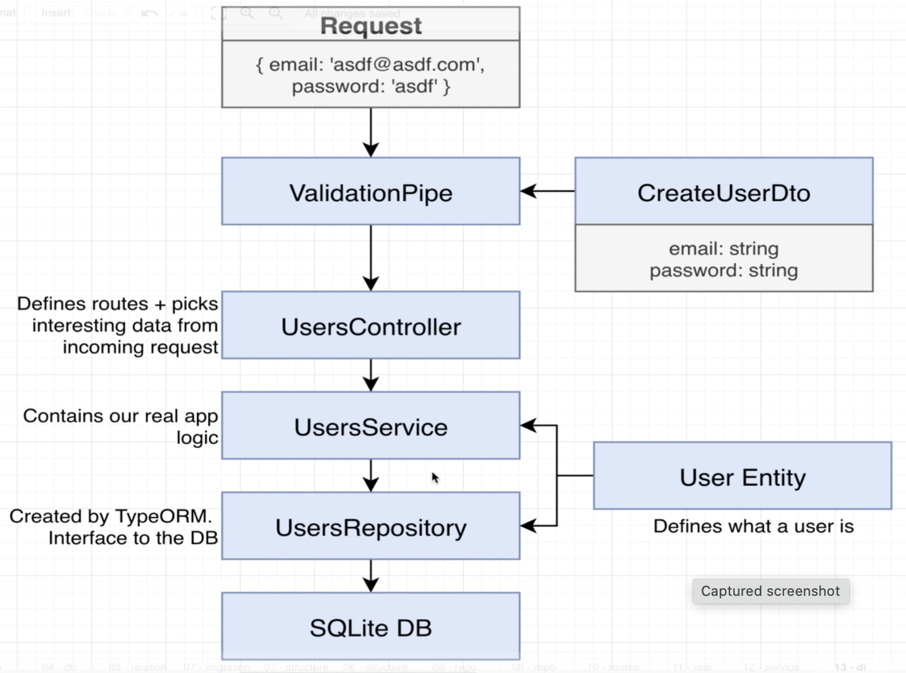
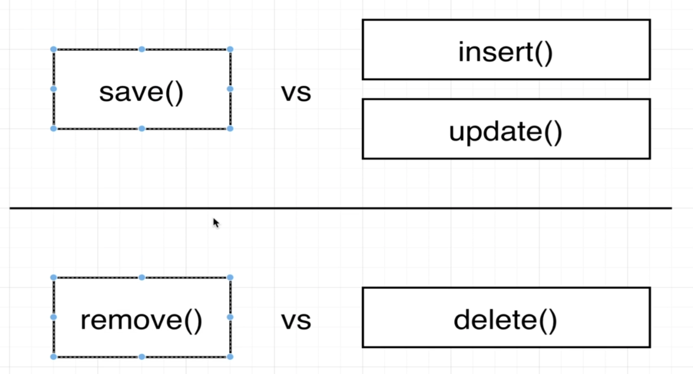
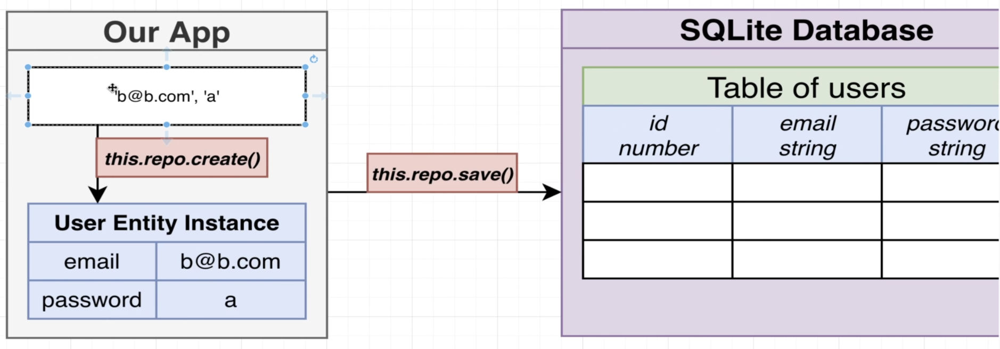
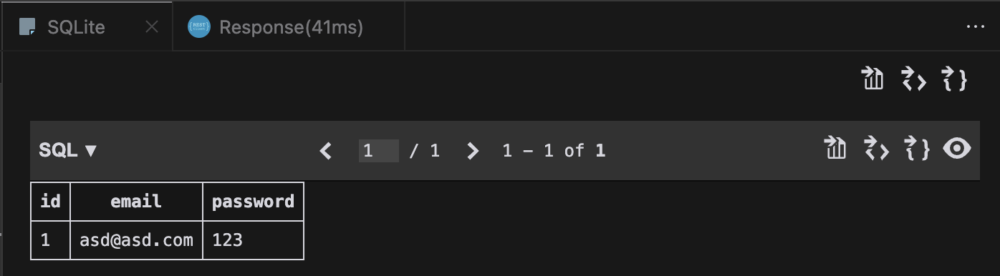
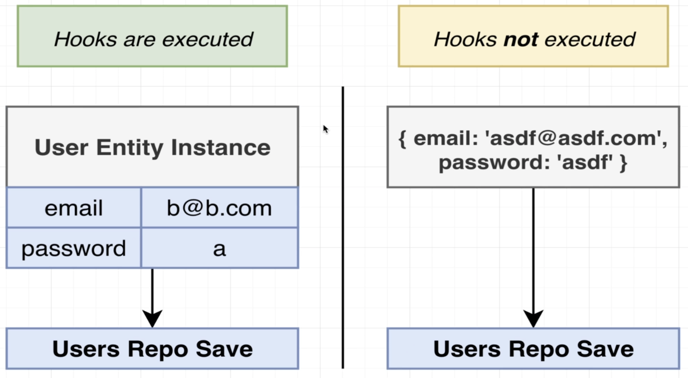
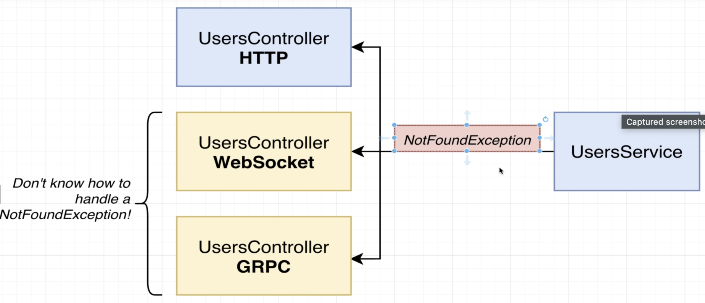

# Section 9: Creating and Saving User Data

## Creating and saving user
  - Repository pattern
    - *https://docs.nestjs.com/techniques/database#repository-pattern*

## Quick Breathing and Review
  - Quick review of flow
  
  

  - The Difference between `save()` and `create()` method in repository
  - Create chỉ tạo entity instance, save sẽ lưu instance vào db
  - Lý do phải dùng create vì nhiều lúc trước khi save db, ở instance entity phải handle 1 số logic như validation...
  
  

## More on Create vs Save
  - Hooks decorator
    - `@AfterInsert, @AfterRemove, @AfterUpdate` of typeorm module
  
  - Nếu chỉ lưu plain object trong `save({email, password})` thì hook sẽ ko hoạt động
  - Save and Remove method chỉ work với entity instance
  

## Querying for Data
## Updating Data
## Removing Users
## Finding and Filtering Records
## Removing Records
## Updating Records
## A Few Notes on Exceptions
  - Exception with multiple protocols
  
  - *https://docs.nestjs.com/exception-filters#exception-filters*
  - *https://docs.nestjs.com/websockets/exception-filters*
